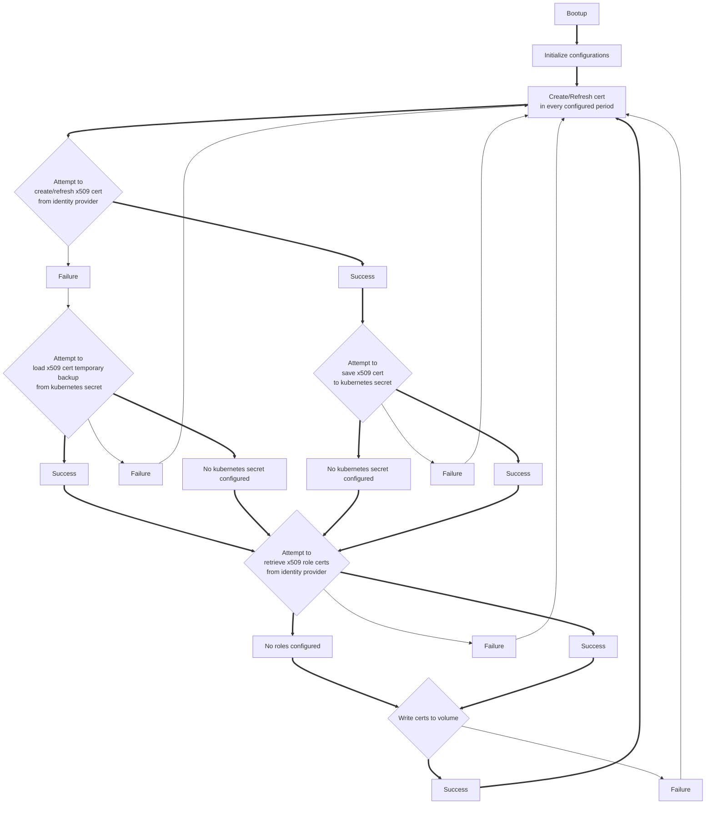

# k8s-athenz-sia

## Lifecycle



## Usage
```
Usage of athenz-sia:
  -backup-mode string
    	Kubernetes secret backup mode, must be one of read or write (Note: Do not perform writes with a large number of concurrency) (default "read")
  -delete-instance-id
    	delete x509 cert record from identity provider when stop signal is sent (default true)
  -dns-suffix string
    	DNS Suffix for certs
  -endpoint string
    	Athenz ZTS endpoint
  -log-dir string
    	directory to store the server log files (default "/var/log/athenz-sia")
  -log-level string
    	logging level (default "INFO")
  -mode string
    	mode, must be one of init or refresh, required (default "init")
  -out-ca-cert string
    	CA cert file to write (default "/var/run/athenz/ca.cert.pem")
  -out-cert string
    	cert file to write (default "/var/run/athenz/service.cert.pem")
  -out-cert-secret string
    	Kubernetes secret name to backup cert (Backup will be disabled if empty)
  -out-key string
    	key file to write (default "/var/run/athenz/service.key.pem")
  -out-rolecert-dir string
    	directory to write cert file for role certificates (default "/var/run/athenz/")
  -provider-service string
    	Identity Provider service
  -refresh-interval string
    	cert refresh interval (default "24h")
  -sa-token-file string
    	bound sa jwt token file location (default "/var/run/secrets/kubernetes.io/bound-serviceaccount/token")
  -server-ca-cert string
    	path to CA cert file to verify ZTS server certs
  -target-domain-roles string
    	target Athenz roles with domain (e.g. athenz.subdomain:role.admin,sys.auth:role.providers)
```
