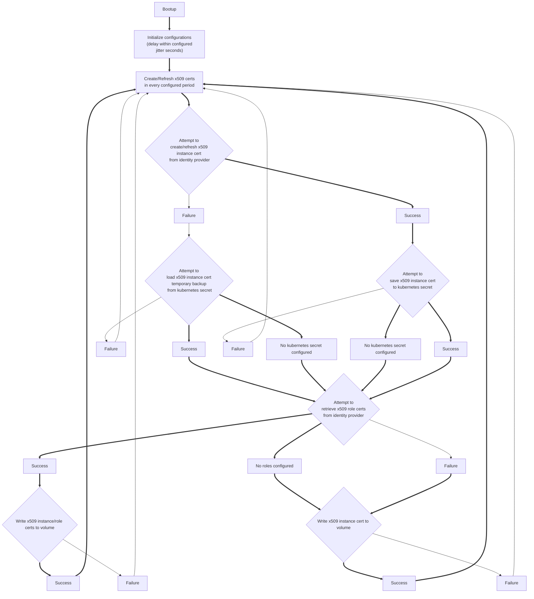

# K8s athenz SIA

## Lifecycle


```mermaid
  graph TD;
      A[Bootup]==>B["Initialize configurations<br/> (delay within configured jitter seconds)"];
      B==>C[Create/Refresh x509 certs<br/> in every configured period];
      C==>D{Attempt to<br/> create/refresh x509 instance cert<br/> from identity provider};
      D==>E[Success];
      D-->E'[Failure];
      E'-->F{Attempt to<br/> load x509 instance cert temporary backup<br/> from kubernetes secret}
      F==>G[Success];
      G==>J
      F-->G'[Failure];
      G'-->C
      F==>G''[No kubernetes secret configured];
      G''==>J
      E==>H{Attempt to<br/> save x509 instance cert<br/> to kubernetes secret};
      H==>I[Success];
      H-->I'[Failure];
      I'-->C
      H==>I''[No kubernetes secret configured];
      I''==>J
      I==>J{Attempt to<br/> retrieve x509 role certs<br/> from identity provider};
      J==>K[Success];
      J-->K'[Failure];
      J==>K''[No roles configured];
      K''==>N
      K==>L{Write x509 instance/role certs to volume}
      L==>M[Success];
      L-->M'[Failure];
      M'-->C
      M==>C
      K'==>N{Write x509 instance cert to volume}
      N==>O[Success];
      N-->O'[Failure];
      O'-->C
      O==>C
```

## Usage
```
$GOPATH/bin/athenz-sia --help
```

### Test
```
make test
```
