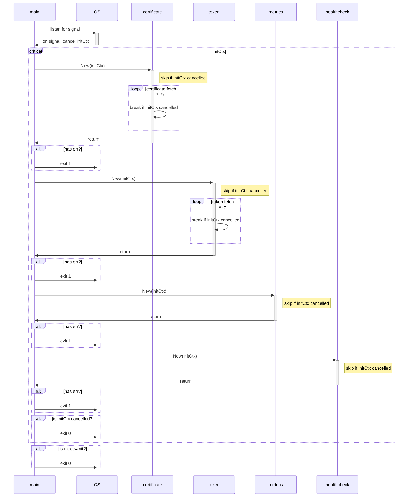

# MODE=init Specification

> [!IMPORTANT]
> This document based on [commit b739c60](https://github.com/AthenZ/k8s-athenz-sia/commit/b739c6062fb7baf83e96af90cb0d1580648003fa).

- [Sequence Diagram](#sequence-diagram)
- [Expectation](#expectation)
- [Logs](#logs)
  - [000](#000)
  - [001](#001)
  - [002](#002)
  - [003](#003)
  - [004](#004)
  - [005](#005)
  - [006](#006)
  - [007](#007)
  - [008](#008)
  - [009](#009)
  - [010](#010)
  - [011](#011)
  - [012](#012)
  - [013](#013)
  - [014](#014)
  - [015](#015)

## Sequence Diagram



## Expectation

- On error or signal, for system integration, the whole code block should complete its execution instead of stopping immediately.
- Retry should stop when the current context is cancelled.
- Extra execution should be skipped if the current context is cancelled.
- 🌟 implies that the specification is NOT fixed.

> [!NOTE]
> The following test results are created by editing the source code to simulate the expected behavior. Refer to [commit f06a625](https://github.com/AthenZ/k8s-athenz-sia/commit/f06a625d7de90600020f79cabadce2ef1d15a052) for the editing details.

| case ID | event        | trigger time                     | certificate  | token                 | metrics      | healthcheck  | exit code |
| ------- | ------------ | -------------------------------- | ------------ | --------------------- | ------------ | ------------ | --------- |
| 000     | normal start | N/A                              | ✅ success    | ✅ success             | ✅ success    | ✅ success    | 0         |
| 001     | SIGINT       | before `listen for signal`       | NOT executed | NOT executed          | NOT executed | NOT executed | 2         |
| 002     | SIGINT       | before `certificate New()`       | ⏭️ skipped    | ⏭️ skipped             | ⏭️ skipped    | ⏭️ skipped    | 0         |
| 003     | SIGINT       | before `token New()`             | ✅ success    | ⏭️ skipped             | ⏭️ skipped    | ⏭️ skipped    | 0         |
| 004     | SIGINT       | before `metrics New()`           | ✅ success    | ✅ success             | ⏭️ skipped    | ⏭️ skipped    | 0         |
| 005     | SIGINT       | before `healthcheck New()`       | ✅ success    | ✅ success             | ✅ success    | ⏭️ skipped    | 0         |
| 006     | SIGINT       | before `is initCtx cancelled?`   | ✅ success    | ✅ success             | ✅ success    | ✅ success    | 0         |
| 007     | SIGINT       | before `is mode=init?`           | ✅ success    | ✅ success             | ✅ success    | ✅ success    | 0         |
| 008     | SIGINT       | during `certificate fetch retry` | ❌ error      | NOT executed          | NOT executed | NOT executed | 1         |
| 009 🌟   | SIGINT       | during `token fetch retry`       | ✅ success    | ✅ success (partially) | ⏭️ skipped    | ⏭️ skipped    | 0         |
| 010     | retry error  | in  `certificate New()`          | ❌ error      | NOT executed          | NOT executed | NOT executed | 1         |
| 011 🌟   | retry error  | in  `token New()`                | ✅ success    | ✅ success (partially) | ✅ success    | ✅ success    | 0         |
| 012     | error        | in `certificate New()`           | ❌ error      | NOT executed          | NOT executed | NOT executed | 1         |
| 013     | error        | in  `token New()`                | ✅ success    | ❌ error               | NOT executed | NOT executed | 1         |
| 014     | error        | in  `metrics New()`              | ✅ success    | ✅ success             | ❌ error      | NOT executed | 1         |
| 015     | error        | in  `healthcheck New()`          | ✅ success    | ✅ success             | ✅ success    | ❌ error      | 1         |

## Logs

<details>
<summary>Click to expand!</summary>

### 000

```text
...
INFO[2024-03-14T00:09:43+09:00] [New Role Certificate] Subject: CN=user.wfan.provider:role.dummy-role,OU=Athenz,O=,ST=,C=US, Issuer: CN=YPKI Signed Athenz CA,OU=Athenz,O=Athenz,ST=Tokyo,C=JP, NotBefore: 2024-03-13 15:09:43 +0000 UTC, NotAfter: 2054-02-06 02:13:43 +0000 UTC, SerialNumber: 1710342583035, DNSNames: [mac.user-wfan-instance.athenz.yahoo.co.jp]
...
INFO[2024-03-14T00:09:43+09:00] [New Access Token] Domain: user.wfan.provider, Role: dummy-role
INFO[2024-03-14T00:09:43+09:00] [New Role Token] Domain: user.wfan.provider, Role: dummy-role
INFO[2024-03-14T00:09:43+09:00] Token server is disabled for init mode: address[:8880]
INFO[2024-03-14T00:09:43+09:00] Metrics exporter is disabled for init mode: address[:9999]
INFO[2024-03-14T00:09:43+09:00] Health check server is disabled for init mode: address[:9998]
INFO[2024-03-14T00:09:43+09:00] Init completed!
Process 95157 has exited with status 0
```

### 001

```text
INFO[2024-03-14T00:35:12+09:00] Starting [athenz-sia] with version [65da743], built on [2024-03-14T00:08:58JST+0900]
...
Process 97566 has exited with status 2
```

### 002

```text
...
INFO[2024-03-14T00:32:06+09:00] Received signal: interrupt
INFO[2024-03-14T00:32:07+09:00] Skipped certificate provider initiation
INFO[2024-03-14T00:32:07+09:00] Skipped token provider initiation
INFO[2024-03-14T00:32:07+09:00] Skipped metrics exporter initiation
INFO[2024-03-14T00:32:07+09:00] Skipped health check initiation
INFO[2024-03-14T00:32:07+09:00] Init stopped by cause: received signal: interrupt
Process 96346 has exited with status 0
```

### 003

```text
...
INFO[2024-03-14T00:29:23+09:00] Certificate provisioning is disabled with empty options: provider service[]
...
INFO[2024-03-14T00:29:23+09:00] Received signal: interrupt
...
INFO[2024-03-14T00:29:23+09:00] [New Role Certificate] Subject: CN=user.wfan.provider:role.dummy-role,OU=Athenz,O=,ST=,C=US, Issuer: CN=YPKI Signed Athenz CA,OU=Athenz,O=Athenz,ST=Tokyo,C=JP, NotBefore: 2024-03-13 15:29:23 +0000 UTC, NotAfter: 2054-02-06 02:13:23 +0000 UTC, SerialNumber: 1710343763618, DNSNames: [mac.user-wfan-instance.athenz.yahoo.co.jp]
INFO[2024-03-14T00:29:23+09:00] Skipped token provider initiation
INFO[2024-03-14T00:29:23+09:00] Skipped metrics exporter initiation
INFO[2024-03-14T00:29:23+09:00] Skipped health check initiation
INFO[2024-03-14T00:29:23+09:00] Init stopped by cause: received signal: interrupt
Process 95157 has exited with status 0
```

### 004

```text
...
INFO[2024-03-14T00:44:00+09:00] Certificate provisioning is disabled with empty options: provider service[]
...
INFO[2024-03-14T00:44:00+09:00] [New Role Certificate] Subject: CN=user.wfan.provider:role.dummy-role,OU=Athenz,O=,ST=,C=US, Issuer: CN=YPKI Signed Athenz CA,OU=Athenz,O=Athenz,ST=Tokyo,C=JP, NotBefore: 2024-03-13 15:44:00 +0000 UTC, NotAfter: 2054-02-06 02:14:00 +0000 UTC, SerialNumber: 1710344640182, DNSNames: [mac.user-wfan-instance.athenz.yahoo.co.jp]
INFO[2024-03-14T00:44:00+09:00] Create ZTS client to fetch tokens: ...
...
INFO[2024-03-14T00:44:00+09:00] Received signal: interrupt
...
INFO[2024-03-14T00:44:00+09:00] [New Access Token] Domain: user.wfan.provider, Role: dummy-role
INFO[2024-03-14T00:44:00+09:00] [New Role Token] Domain: user.wfan.provider, Role: dummy-role
INFO[2024-03-14T00:44:00+09:00] Token server is disabled for init mode: address[:8880]
INFO[2024-03-14T00:44:00+09:00] Skipped metrics exporter initiation
INFO[2024-03-14T00:44:00+09:00] Skipped health check initiation
INFO[2024-03-14T00:44:00+09:00] Init stopped by cause: received signal: interrupt
Process 1414 has exited with status 0
```

### 005

```text
...
INFO[2024-03-14T00:49:01+09:00] Token server is disabled for init mode: address[:8880]
INFO[2024-03-14T00:49:01+09:00] Metrics exporter is disabled for init mode: address[:9999]
INFO[2024-03-14T00:49:01+09:00] Received signal: interrupt
INFO[2024-03-14T00:49:02+09:00] Skipped health check initiation
INFO[2024-03-14T00:49:02+09:00] Init stopped by cause: received signal: interrupt
Process 3637 has exited with status 0
```

### 006

```text
...
INFO[2024-03-14T00:50:12+09:00] Token server is disabled for init mode: address[:8880]
INFO[2024-03-14T00:50:12+09:00] Metrics exporter is disabled for init mode: address[:9999]
INFO[2024-03-14T00:50:12+09:00] Health check server is disabled for init mode: address[:9998]
INFO[2024-03-14T00:50:12+09:00] Received signal: interrupt
INFO[2024-03-14T00:50:13+09:00] Init stopped by cause: received signal: interrupt
Process 4811 has exited with status 0
```

### 007

```text
...
INFO[2024-03-14T00:55:25+09:00] Token server is disabled for init mode: address[:8880]
INFO[2024-03-14T00:55:25+09:00] Metrics exporter is disabled for init mode: address[:9999]
INFO[2024-03-14T00:55:25+09:00] Health check server is disabled for init mode: address[:9998]
INFO[2024-03-14T00:55:25+09:00] Received signal: interrupt
INFO[2024-03-14T00:55:26+09:00] Init completed!
Process 5378 has exited with status 0
```

### 008

```text
...
WARNING[2024-03-14T00:59:25+09:00] Error while requesting x509 role certificate to identity provider: PostRoleCertificateRequest failed for principal[user.wfan.instance.mac] to get Role Subject CommonName[user.wfan.provider:role.retry], err: 403 postrolecertificaterequestext: principal user.wfan.instance.mac is not included in the requested role(s) in domain user.wfan.provider
ERROR[2024-03-14T00:59:25+09:00] Failed to get initial certificates: PostRoleCertificateRequest failed for principal[user.wfan.instance.mac] to get Role Subject CommonName[user.wfan.provider:role.retry], err: 403 postrolecertificaterequestext: principal user.wfan.instance.mac is not included in the requested role(s) in domain user.wfan.provider. Retrying in 15.698318904s
INFO[2024-03-14T00:59:27+09:00] Received signal: interrupt
ERROR[2024-03-14T00:59:27+09:00] Failed to get initial certificates after multiple retries for init mode: PostRoleCertificateRequest failed for principal[user.wfan.instance.mac] to get Role Subject CommonName[user.wfan.provider:role.retry], err: 403 postrolecertificaterequestext: principal user.wfan.instance.mac is not included in the requested role(s) in domain user.wfan.provider
FATAL[2024-03-14T00:59:27+09:00] Error initiating certificate provider: PostRoleCertificateRequest failed for principal[user.wfan.instance.mac] to get Role Subject CommonName[user.wfan.provider:role.retry], err: 403 postrolecertificaterequestext: principal user.wfan.instance.mac is not included in the requested role(s) in domain user.wfan.provider
Process 5378 has exited with status 1
```

### 009

```text
...
ERROR[2024-03-14T01:04:47+09:00] Failed to refresh tokens: GetRoleToken failed for target [{user.wfan.provider:role.retry,,0,0}], err: 403 getroletoken: principal user.wfan.instance.mac is not included in the requested role(s) in domain user.wfan.provider. Retrying in 29.360055765s
ERROR[2024-03-14T01:04:52+09:00] Failed to refresh tokens: PostAccessTokenRequest failed for target [{user.wfan.provider:role.retry,,0,0}], err: 403 postaccesstokenrequest: principal user.wfan.instance.mac is not included in the requested role(s) in domain user.wfan.provider. Retrying in 18.9653697s
INFO[2024-03-14T01:04:54+09:00] Received signal: interrupt
INFO[2024-03-14T01:04:54+09:00] Token cache updated. accesstoken:success[1],error[1]; roletoken:success[1],error[1]
ERROR[2024-03-14T01:04:54+09:00] Failed to refresh tokens after multiple retries: GetRoleToken failed for target [{user.wfan.provider:role.retry,,0,0}], err: 403 getroletoken: principal user.wfan.instance.mac is not included in the requested role(s) in domain user.wfan.provider
ERROR[2024-03-14T01:04:54+09:00] Failed to refresh tokens after multiple retries: PostAccessTokenRequest failed for target [{user.wfan.provider:role.retry,,0,0}], err: 403 postaccesstokenrequest: principal user.wfan.instance.mac is not included in the requested role(s) in domain user.wfan.provider
INFO[2024-03-14T01:04:54+09:00] [New Access Token] Domain: user.wfan.provider, Role: dummy-role
INFO[2024-03-14T01:04:54+09:00] [New Role Token] Domain: user.wfan.provider, Role: dummy-role
INFO[2024-03-14T01:04:54+09:00] Token server is disabled for init mode: address[:8880]
INFO[2024-03-14T01:04:54+09:00] Skipped metrics exporter initiation
INFO[2024-03-14T01:04:54+09:00] Skipped health check initiation
INFO[2024-03-14T01:04:54+09:00] Init stopped by cause: received signal: interrupt
Process 5378 has exited with status 0
```

### 010

```text
...
WARNING[2024-03-14T01:10:48+09:00] Error while requesting x509 role certificate to identity provider: PostRoleCertificateRequest failed for principal[user.wfan.instance.mac] to get Role Subject CommonName[user.wfan.provider:role.retry], err: 403 postrolecertificaterequestext: principal user.wfan.instance.mac is not included in the requested role(s) in domain user.wfan.provider
ERROR[2024-03-14T01:10:48+09:00] Failed to get initial certificates after multiple retries for init mode: PostRoleCertificateRequest failed for principal[user.wfan.instance.mac] to get Role Subject CommonName[user.wfan.provider:role.retry], err: 403 postrolecertificaterequestext: principal user.wfan.instance.mac is not included in the requested role(s) in domain user.wfan.provider
FATAL[2024-03-14T01:10:48+09:00] Error initiating certificate provider: PostRoleCertificateRequest failed for principal[user.wfan.instance.mac] to get Role Subject CommonName[user.wfan.provider:role.retry], err: 403 postrolecertificaterequestext: principal user.wfan.instance.mac is not included in the requested role(s) in domain user.wfan.provider
Process 5378 has exited with status 1
```

### 011

```text
...
INFO[2024-03-14T01:16:50+09:00] Token cache updated. accesstoken:success[1],error[1]; roletoken:success[1],error[1]
ERROR[2024-03-14T01:16:50+09:00] Failed to refresh tokens after multiple retries: GetRoleToken failed for target [{user.wfan.provider:role.retry,,0,0}], err: 403 getroletoken: principal user.wfan.instance.mac is not included in the requested role(s) in domain user.wfan.provider
ERROR[2024-03-14T01:16:50+09:00] Failed to refresh tokens after multiple retries: PostAccessTokenRequest failed for target [{user.wfan.provider:role.retry,,0,0}], err: 403 postaccesstokenrequest: principal user.wfan.instance.mac is not included in the requested role(s) in domain user.wfan.provider
INFO[2024-03-14T01:16:50+09:00] [New Access Token] Domain: user.wfan.provider, Role: dummy-role
INFO[2024-03-14T01:16:50+09:00] [New Role Token] Domain: user.wfan.provider, Role: dummy-role
INFO[2024-03-14T01:16:50+09:00] Token server is disabled for init mode: address[:8880]
INFO[2024-03-14T01:16:50+09:00] Metrics exporter is disabled for init mode: address[:9999]
INFO[2024-03-14T01:16:50+09:00] Health check server is disabled for init mode: address[:9998]
INFO[2024-03-14T01:16:50+09:00] Init completed!
Process 5378 has exited with status 0
```

### 012

```text
...
INFO[2024-03-15T15:38:15+09:00] [New Role Certificate] Subject: CN=user.wfan.provider:role.dummy-role,OU=Athenz,O=,ST=,C=US, Issuer: CN=YPKI Signed Athenz CA,OU=Athenz,O=Athenz,ST=Tokyo,C=JP, NotBefore: 2024-03-15 06:38:15 +0000 UTC, NotAfter: 2054-02-06 02:13:15 +0000 UTC, SerialNumber: 1710484695930, DNSNames: [mac.user-wfan-instance.athenz.yahoo.co.jp]
FATAL[2024-03-15T15:38:15+09:00] Error initiating certificate provider: test error
Process 23905 has exited with status 1
```

### 013

```text
...
INFO[2024-03-14T01:20:10+09:00] [New Access Token] Domain: user.wfan.provider, Role: dummy-role
INFO[2024-03-14T01:20:10+09:00] [New Role Token] Domain: user.wfan.provider, Role: dummy-role
FATAL[2024-03-14T01:20:10+09:00] Error initiating token provider: test error
Process 23905 has exited with status 1
```

### 014

```text
...
INFO[2024-03-14T01:21:27+09:00] Token server is disabled for init mode: address[:8880]
FATAL[2024-03-14T01:21:27+09:00] Error initiating metrics exporter: test error
Process 24533 has exited with status 1
```

### 015

```text
...
INFO[2024-03-14T01:23:13+09:00] Token server is disabled for init mode: address[:8880]
INFO[2024-03-14T01:23:13+09:00] Metrics exporter is disabled for init mode: address[:9999]
FATAL[2024-03-14T01:23:13+09:00] Error initiating health check: test error
Process 25220 has exited with status 1
```
</details>
