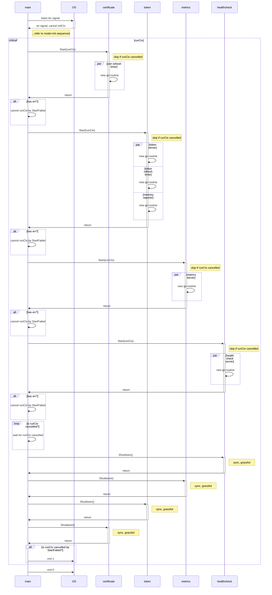

# MODE=refresh Specification

> [!IMPORTANT]
> This document based on [commit b739c60](https://github.com/AthenZ/k8s-athenz-sia/commit/b739c6062fb7baf83e96af90cb0d1580648003fa).

- [Sequence Diagram](#sequence-diagram)
- [Expectation](#expectation)
- [Logs](#logs)
  - [100](#100)
  - [101](#101)
  - [102](#102)
  - [103](#103)
  - [104](#104)
  - [105](#105)
  - [106](#106)
  - [107](#107)
  - [108](#108)
  - [109](#109)
  - [110](#110)
  - [111](#111)
  - [112](#112)
  - [113](#113)
  - [114](#114)
  - [115](#115)
  - [116](#116)
  - [117](#117)
  - [118](#118)
  - [119](#119)
  - [120](#120)
  - [121](#121)

## Sequence Diagram



## Expectation

- On error or signal, for system integration, the whole code block should complete its execution instead of stopping immediately.
- Retry should stop when the current context is cancelled.
- Extra execution should be skipped if the current context is cancelled.
- goroutines should ONLY be created in `Start()`
  - `Shutdown()` should notify ALL the goroutines to stop, and wait until ALL the goroutines stopped gracefully
    - `shutdownChan` is used for the notification.
    - `shutdownWg` is used to wait until ALL the goroutines stopped gracefully.
- To confirm a HTTP server is ready, so that it can be shutdown gracefully. `WaitForServerReady()` should ONLY be *success* OR *retry until error* (max. 1 min) instead of allowing cancellation.
- Once `Start()` is called, ALL `Shutdown()` should always be executed to shutdown gracefully.

> [!NOTE]
> The following test results are created by editing the source code to simulate the expected behavior. Refer to [commit f06a625](https://github.com/AthenZ/k8s-athenz-sia/commit/f06a625d7de90600020f79cabadce2ef1d15a052) for the editing details.

| case ID | event                | trigger time                                                 | certificate | token     | metrics   | healthcheck | ALL `Shutdown()` | exit code |
| ------- | -------------------- | ------------------------------------------------------------ | ----------- | --------- | --------- | ----------- | ---------------- | --------- |
| 100     | SIGINT (normal case) | before `is runCtx cancelled?`                                 | ✅ success   | ✅ success | ✅ success | ✅ success   | ✅ success        | 0         |
| 101     | SIGINT               | before `certificate Start(runCtx)`                           | ⏭️ skipped   | ⏭️ skipped | ⏭️ skipped | ⏭️ skipped   | ✅ success        | 0         |
| 102     | SIGINT               | before `token Start(runCtx)`                                 | ✅ success   | ⏭️ skipped | ⏭️ skipped | ⏭️ skipped   | ✅ success        | 0         |
| 103     | SIGINT               | before `metrics Start(runCtx)`                               | ✅ success   | ✅ success | ⏭️ skipped | ⏭️ skipped   | ✅ success        | 0         |
| 104     | SIGINT               | before `healthcheck Start(runCtx)`                           | ✅ success   | ✅ success | ✅ success | ⏭️ skipped   | ✅ success        | 0         |
| 105     | SIGINT               | before `cert refresh timer goroutine`                        | ✅ success   | ⏭️ skipped | ⏭️ skipped | ⏭️ skipped   | ✅ success        | 0         |
| 106     | SIGINT               | before `token server goroutine`                              | ✅ success   | ✅ success | ⏭️ skipped | ⏭️ skipped   | ✅ success        | 0         |
| 107     | SIGINT               | before `token refresh timer goroutine`                       | ✅ success   | ✅ success | ⏭️ skipped | ⏭️ skipped   | ✅ success        | 0         |
| 108     | SIGINT               | before `memory reporter goroutine`                           | ✅ success   | ✅ success | ⏭️ skipped | ⏭️ skipped   | ✅ success        | 0         |
| 109     | SIGINT               | before `metrics server goroutine`                            | ✅ success   | ✅ success | ✅ success | ⏭️ skipped   | ✅ success        | 0         |
| 110     | SIGINT               | before `healthcheck server goroutine`                        | ✅ success   | ✅ success | ✅ success | ✅ success   | ✅ success        | 0         |
| 111     | error                | in `certificate Start(runCtx)`                               | ❌ error     | ⏭️ skipped | ⏭️ skipped | ⏭️ skipped   | ✅ success        | 1         |
| 112     | error                | in `token Start(runCtx)`                                     | ✅ success   | ❌ error   | ⏭️ skipped | ⏭️ skipped   | ✅ success        | 1         |
| 113     | error                | in `metrics Start(runCtx)`                                   | ✅ success   | ✅ success | ❌ error   | ⏭️ skipped   | ✅ success        | 1         |
| 114     | error                | in `healthcheck Start(runCtx)`                               | ✅ success   | ✅ success | ✅ success | ❌ error     | ✅ success        | 1         |
| 115     | error + SIGINT       | error in `metrics Start(runCtx)`, SIGINT during `Shutdown()` | ✅ success   | ✅ success | ❌ error   | ⏭️ skipped   | ✅ success        | 1         |
| 116     | retry error          | after `ALL Start()`, during `certificate refresh retry`      | ✅ success   | ✅ success | ✅ success | ✅ success   | ✅ success        | NO exit   |
| 117    | SIGINT               | after `ALL Start()`, during `certificate refresh retry`      | ✅ success   | ✅ success | ✅ success | ✅ success   | ✅ success        | 0         |
| 118     | SIGINT    | after `ALL Start()`, during `certificate refresh retry`<br/>(last timer interval runs before Shutdown()) | ✅ success<br/>(last interval skipped)   | ✅ success | ✅ success | ✅ success   | ✅ success        | 0  |
| 119     | retry error          | after `ALL Start()`, during `token refresh retry`            | ✅ success   | ✅ success | ✅ success | ✅ success   | ✅ success        | NO exit   |
| 120     | SIGINT               | after `ALL Start()`, during `token refresh retry`            | ✅ success   | ✅ success | ✅ success | ✅ success   | ✅ success        | 0         |
| 121     | SIGINT    | after `ALL Start()`, during `token refresh retry`<br/>(last timer interval runs before Shutdown())            | ✅ success   | ✅ success<br/>(last interval skipped) | ✅ success | ✅ success   | ✅ success        | 0  |

## Logs

<details>
<summary>Click to expand!</summary>

### 100

```text
INFO[2024-03-14T11:22:55+09:00] Starting token provider server[:8880]
INFO[2024-03-14T11:22:55+09:00] Will refresh key[./.local/private.pem], cert[./.local/cert.pem] and certificates for roles[[user.wfan.provider:role.dummy-role]] with provider[], backup[read+write] and secret[] within 24h0m0s
INFO[2024-03-14T11:22:55+09:00] Received request: method[GET], endpoint[/], remoteAddr[127.0.0.1:64953] requestID[f4ee534f-8a39-4fa5-9c12-94f1eeb6354b]
WARNING[2024-03-14T11:22:55+09:00] Client error: while handling request with: X-Athenz-Domain[] X-Athenz-Role[], error[http headers not set: X-Athenz-Domain[] X-Athenz-Role[].]
INFO[2024-03-14T11:22:55+09:00] Response sent: statusCode[400], latency[140.917µs], requestID[f4ee534f-8a39-4fa5-9c12-94f1eeb6354b]
INFO[2024-03-14T11:22:55+09:00] Starting metrics exporter server[:9999]
INFO[2024-03-14T11:22:55+09:00] Will refresh cached tokens within 30m0s
INFO[0000] 1 valid certificate(s) found in ".local/ca.pem"
WARNING[2024-03-14T11:22:55+09:00] Failed to confirm the server ready with GET request: Get "http://:9999": dial tcp :9999: connect: connection refused. Retrying in 5.796699685s
INFO[0000] 3 valid certificate(s) found in ".local/cert.pem"
INFO[0000] 2 valid certificate(s) found in ".local/user.wfan.provider_dummy-role.cert.pem"
INFO[0000] parsed 5 certificates (1 read failures)
level=info ts=2024-03-14T02:22:55.144Z caller=tls_config.go:313 msg="Listening on" address=[::]:9999
level=info ts=2024-03-14T02:22:55.144Z caller=tls_config.go:316 msg="TLS is disabled." http2=false address=[::]:9999
INFO[2024-03-14T11:23:00+09:00] Starting health check server[:9998]

INFO[2024-03-14T11:23:08+09:00] Received signal: interrupt
INFO[2024-03-14T11:23:08+09:00] Initiating shutdown by cause: received signal: interrupt ...
INFO[2024-03-14T11:23:08+09:00] Initiating shutdown of health check daemon ...
INFO[2024-03-14T11:23:08+09:00] Stopped health check server
INFO[2024-03-14T11:23:08+09:00] Initiating shutdown of metrics exporter daemon ...
INFO[2024-03-14T11:23:08+09:00] Stopped metrics exporter server
INFO[2024-03-14T11:23:08+09:00] Initiating shutdown of token provider daemon ...
INFO[2024-03-14T11:23:08+09:00] Delaying token provider server shutdown for 0s to shutdown gracefully ...
INFO[2024-03-14T11:23:08+09:00] Stopped memory reporter daemon
INFO[2024-03-14T11:23:08+09:00] Stopped token provider daemon
INFO[2024-03-14T11:23:08+09:00] Stopped token provider server
INFO[2024-03-14T11:23:08+09:00] Initiating shutdown of certificate provider daemon ...
INFO[2024-03-14T11:23:08+09:00] Stopped certificate provider daemon
INFO[2024-03-14T11:23:08+09:00] Shutdown completed!
Process 5378 has exited with status 0
```

### 101

```text
...
INFO[2024-03-18T15:28:47+09:00] [New Access Token] Domain: user.wfan.provider, Role: dummy-role
INFO[2024-03-18T15:28:47+09:00] [New Role Token] Domain: user.wfan.provider, Role: dummy-role
INFO[2024-03-18T15:28:47+09:00] Received signal: interrupt
INFO[2024-03-18T15:28:48+09:00] Skipped certificate provider start
INFO[2024-03-18T15:28:48+09:00] Skipped token provider start
INFO[2024-03-18T15:28:48+09:00] Skipped metrics exporter start
INFO[2024-03-18T15:28:48+09:00] Skipped health check start
INFO[2024-03-18T15:28:48+09:00] Initiating shutdown by cause: received signal: interrupt ...
INFO[2024-03-18T15:28:48+09:00] Initiating shutdown of health check daemon ...
INFO[2024-03-18T15:28:48+09:00] Initiating shutdown of metrics exporter daemon ...
INFO[2024-03-18T15:28:48+09:00] Initiating shutdown of token provider daemon ...
INFO[2024-03-18T15:28:48+09:00] Initiating shutdown of certificate provider daemon ...
INFO[2024-03-18T15:28:48+09:00] Shutdown completed!
Process 32497 has exited with status 0
```

### 102

```text
...
INFO[2024-03-18T15:34:07+09:00] [New Access Token] Domain: user.wfan.provider, Role: dummy-role
INFO[2024-03-18T15:34:07+09:00] [New Role Token] Domain: user.wfan.provider, Role: dummy-role
INFO[2024-03-18T15:34:07+09:00] Will refresh key[./.local/private.pem], cert[./.local/cert.pem] and certificates for roles[[user.wfan.provider:role.dummy-role]] with provider[], backup[read+write] and secret[] within 24h0m0s
INFO[2024-03-18T15:34:07+09:00] Received signal: interrupt
INFO[2024-03-18T15:34:08+09:00] Skipped token provider start
INFO[2024-03-18T15:34:08+09:00] Skipped metrics exporter start
INFO[2024-03-18T15:34:08+09:00] Skipped health check start
INFO[2024-03-18T15:34:08+09:00] Initiating shutdown by cause: received signal: interrupt ...
INFO[2024-03-18T15:34:08+09:00] Initiating shutdown of health check daemon ...
INFO[2024-03-18T15:34:08+09:00] Initiating shutdown of metrics exporter daemon ...
INFO[2024-03-18T15:34:08+09:00] Initiating shutdown of token provider daemon ...
INFO[2024-03-18T15:34:08+09:00] Initiating shutdown of certificate provider daemon ...
INFO[2024-03-18T15:34:08+09:00] Stopped certificate provider daemon
INFO[2024-03-18T15:34:08+09:00] Shutdown completed!
Process 35406 has exited with status 0
```

### 103

```text
...
INFO[2024-03-18T15:35:06+09:00] [New Access Token] Domain: user.wfan.provider, Role: dummy-role
INFO[2024-03-18T15:35:06+09:00] [New Role Token] Domain: user.wfan.provider, Role: dummy-role
INFO[2024-03-18T15:35:06+09:00] Starting token provider server[:8880]
INFO[2024-03-18T15:35:06+09:00] Will refresh key[./.local/private.pem], cert[./.local/cert.pem] and certificates for roles[[user.wfan.provider:role.dummy-role]] with provider[], backup[read+write] and secret[] within 24h0m0s
INFO[2024-03-18T15:35:06+09:00] Received request: method[GET], endpoint[/], remoteAddr[127.0.0.1:61448] requestID[524218b5-866b-40d2-9896-25f959a02c10]
WARNING[2024-03-18T15:35:06+09:00] Client error: while handling request with: X-Athenz-Domain[] X-Athenz-Role[], error[http headers not set: X-Athenz-Domain[] X-Athenz-Role[].]
INFO[2024-03-18T15:35:06+09:00] Response sent: statusCode[400], latency[207.75µs], requestID[524218b5-866b-40d2-9896-25f959a02c10]
INFO[2024-03-18T15:35:06+09:00] Will refresh cached tokens within 20s
INFO[2024-03-18T15:35:06+09:00] Received signal: interrupt
INFO[2024-03-18T15:35:07+09:00] Skipped metrics exporter start
INFO[2024-03-18T15:35:07+09:00] Skipped health check start
INFO[2024-03-18T15:35:07+09:00] Initiating shutdown by cause: received signal: interrupt ...
INFO[2024-03-18T15:35:07+09:00] Initiating shutdown of health check daemon ...
INFO[2024-03-18T15:35:07+09:00] Initiating shutdown of metrics exporter daemon ...
INFO[2024-03-18T15:35:07+09:00] Initiating shutdown of token provider daemon ...
INFO[2024-03-18T15:35:07+09:00] Delaying token provider server shutdown for 0s to shutdown gracefully ...
INFO[2024-03-18T15:35:07+09:00] Stopped token provider daemon
INFO[2024-03-18T15:35:07+09:00] Stopped memory reporter daemon
INFO[2024-03-18T15:35:07+09:00] Stopped token provider server
INFO[2024-03-18T15:35:07+09:00] Initiating shutdown of certificate provider daemon ...
INFO[2024-03-18T15:35:07+09:00] Stopped certificate provider daemon
INFO[2024-03-18T15:35:07+09:00] Shutdown completed!
Process 35752 has exited with status 0
```

### 104

```text
...
INFO[2024-03-18T15:36:35+09:00] [New Access Token] Domain: user.wfan.provider, Role: dummy-role
INFO[2024-03-18T15:36:35+09:00] [New Role Token] Domain: user.wfan.provider, Role: dummy-role
INFO[2024-03-18T15:36:35+09:00] Starting token provider server[:8880]
INFO[2024-03-18T15:36:35+09:00] Will refresh key[./.local/private.pem], cert[./.local/cert.pem] and certificates for roles[[user.wfan.provider:role.dummy-role]] with provider[], backup[read+write] and secret[] within 24h0m0s
INFO[2024-03-18T15:36:35+09:00] Received request: method[GET], endpoint[/], remoteAddr[127.0.0.1:61510] requestID[fd092ad1-bea5-47db-9827-13ee0addaea7]
WARNING[2024-03-18T15:36:35+09:00] Client error: while handling request with: X-Athenz-Domain[] X-Athenz-Role[], error[http headers not set: X-Athenz-Domain[] X-Athenz-Role[].]
INFO[2024-03-18T15:36:35+09:00] Response sent: statusCode[400], latency[202.708µs], requestID[fd092ad1-bea5-47db-9827-13ee0addaea7]
INFO[2024-03-18T15:36:35+09:00] Starting metrics exporter server[:9999]
INFO[2024-03-18T15:36:35+09:00] Will refresh cached tokens within 20s
time="2024-03-18T15:36:35+09:00" level=info msg="1 valid certificate(s) found in \".local/ca.pem\""
time="2024-03-18T15:36:35+09:00" level=info msg="3 valid certificate(s) found in \".local/cert.pem\""
time="2024-03-18T15:36:35+09:00" level=info msg="2 valid certificate(s) found in \".local/user.wfan.provider_dummy-role.cert.pem\""
time="2024-03-18T15:36:35+09:00" level=info msg="parsed 5 certificates (1 read failures)"
level=info ts=2024-03-18T06:36:35.904Z caller=tls_config.go:313 msg="Listening on" address=[::]:9999
level=info ts=2024-03-18T06:36:35.904Z caller=tls_config.go:316 msg="TLS is disabled." http2=false address=[::]:9999
INFO[2024-03-18T15:36:35+09:00] Received signal: interrupt
INFO[2024-03-18T15:36:36+09:00] Skipped health check start
INFO[2024-03-18T15:36:36+09:00] Initiating shutdown by cause: received signal: interrupt ...
INFO[2024-03-18T15:36:36+09:00] Initiating shutdown of health check daemon ...
INFO[2024-03-18T15:36:36+09:00] Initiating shutdown of metrics exporter daemon ...
INFO[2024-03-18T15:36:36+09:00] Stopped metrics exporter server
INFO[2024-03-18T15:36:36+09:00] Initiating shutdown of token provider daemon ...
INFO[2024-03-18T15:36:36+09:00] Delaying token provider server shutdown for 0s to shutdown gracefully ...
INFO[2024-03-18T15:36:36+09:00] Stopped token provider server
INFO[2024-03-18T15:36:36+09:00] Stopped token provider daemon
INFO[2024-03-18T15:36:36+09:00] Stopped memory reporter daemon
INFO[2024-03-18T15:36:36+09:00] Initiating shutdown of certificate provider daemon ...
INFO[2024-03-18T15:36:36+09:00] Stopped certificate provider daemon
INFO[2024-03-18T15:36:36+09:00] Shutdown completed!
Process 36325 has exited with status 0
```

### 105

```text
...
INFO[2024-03-18T15:43:05+09:00] [New Access Token] Domain: user.wfan.provider, Role: dummy-role
INFO[2024-03-18T15:43:05+09:00] [New Role Token] Domain: user.wfan.provider, Role: dummy-role
INFO[2024-03-18T15:43:05+09:00] Received signal: interrupt
INFO[2024-03-18T15:43:06+09:00] Skipped token provider start
INFO[2024-03-18T15:43:06+09:00] Skipped metrics exporter start
INFO[2024-03-18T15:43:06+09:00] Will refresh key[./.local/private.pem], cert[./.local/cert.pem] and certificates for roles[[user.wfan.provider:role.dummy-role]] with provider[], backup[read+write] and secret[] within 24h0m0s
INFO[2024-03-18T15:43:06+09:00] Skipped health check start
INFO[2024-03-18T15:43:06+09:00] Initiating shutdown by cause: received signal: interrupt ...
INFO[2024-03-18T15:43:06+09:00] Initiating shutdown of health check daemon ...
INFO[2024-03-18T15:43:06+09:00] Initiating shutdown of metrics exporter daemon ...
INFO[2024-03-18T15:43:06+09:00] Initiating shutdown of token provider daemon ...
INFO[2024-03-18T15:43:06+09:00] Initiating shutdown of certificate provider daemon ...
INFO[2024-03-18T15:43:06+09:00] Stopped certificate provider daemon
INFO[2024-03-18T15:43:06+09:00] Shutdown completed!
Process 39379 has exited with status 0
```

### 106

```text
...
INFO[2024-03-18T15:44:45+09:00] [New Access Token] Domain: user.wfan.provider, Role: dummy-role
INFO[2024-03-18T15:44:45+09:00] [New Role Token] Domain: user.wfan.provider, Role: dummy-role
INFO[2024-03-18T15:44:45+09:00] Will refresh key[./.local/private.pem], cert[./.local/cert.pem] and certificates for roles[[user.wfan.provider:role.dummy-role]] with provider[], backup[read+write] and secret[] within 24h0m0s
INFO[2024-03-18T15:44:45+09:00] Received signal: interrupt
INFO[2024-03-18T15:44:46+09:00] Starting token provider server[:8880]
INFO[2024-03-18T15:44:46+09:00] Received request: method[GET], endpoint[/], remoteAddr[127.0.0.1:61771] requestID[5dfe4c15-4772-4c97-9ca0-b9e2e7278d68]
WARNING[2024-03-18T15:44:46+09:00] Client error: while handling request with: X-Athenz-Domain[] X-Athenz-Role[], error[http headers not set: X-Athenz-Domain[] X-Athenz-Role[].]
INFO[2024-03-18T15:44:46+09:00] Response sent: statusCode[400], latency[930.542µs], requestID[5dfe4c15-4772-4c97-9ca0-b9e2e7278d68]
INFO[2024-03-18T15:44:46+09:00] Skipped metrics exporter start
INFO[2024-03-18T15:44:46+09:00] Skipped health check start
INFO[2024-03-18T15:44:46+09:00] Initiating shutdown by cause: received signal: interrupt ...
INFO[2024-03-18T15:44:46+09:00] Will refresh cached tokens within 20s
INFO[2024-03-18T15:44:46+09:00] Initiating shutdown of health check daemon ...
INFO[2024-03-18T15:44:46+09:00] Initiating shutdown of metrics exporter daemon ...
INFO[2024-03-18T15:44:46+09:00] Initiating shutdown of token provider daemon ...
INFO[2024-03-18T15:44:46+09:00] Delaying token provider server shutdown for 0s to shutdown gracefully ...
INFO[2024-03-18T15:44:46+09:00] Stopped token provider daemon
INFO[2024-03-18T15:44:46+09:00] Stopped token provider server
INFO[2024-03-18T15:44:46+09:00] Stopped memory reporter daemon
INFO[2024-03-18T15:44:46+09:00] Initiating shutdown of certificate provider daemon ...
INFO[2024-03-18T15:44:46+09:00] Stopped certificate provider daemon
INFO[2024-03-18T15:44:46+09:00] Shutdown completed!
Process 40417 has exited with status 0
```

### 107

```text
...
INFO[2024-03-18T15:52:54+09:00] [New Access Token] Domain: user.wfan.provider, Role: dummy-role
INFO[2024-03-18T15:52:54+09:00] [New Role Token] Domain: user.wfan.provider, Role: dummy-role
INFO[2024-03-18T15:52:54+09:00] Starting token provider server[:8880]
INFO[2024-03-18T15:52:54+09:00] Will refresh key[./.local/private.pem], cert[./.local/cert.pem] and certificates for roles[[user.wfan.provider:role.dummy-role]] with provider[], backup[read+write] and secret[] within 24h0m0s
INFO[2024-03-18T15:52:54+09:00] Received request: method[GET], endpoint[/], remoteAddr[127.0.0.1:62007] requestID[67f35609-3e80-4317-ada5-73a208ad5f2c]
WARNING[2024-03-18T15:52:54+09:00] Client error: while handling request with: X-Athenz-Domain[] X-Athenz-Role[], error[http headers not set: X-Athenz-Domain[] X-Athenz-Role[].]
INFO[2024-03-18T15:52:54+09:00] Response sent: statusCode[400], latency[135.75µs], requestID[67f35609-3e80-4317-ada5-73a208ad5f2c]
INFO[2024-03-18T15:52:54+09:00] Received signal: interrupt
INFO[2024-03-18T15:52:55+09:00] Skipped metrics exporter start
INFO[2024-03-18T15:52:55+09:00] Will refresh cached tokens within 20s
INFO[2024-03-18T15:52:55+09:00] Skipped health check start
INFO[2024-03-18T15:52:55+09:00] Initiating shutdown by cause: received signal: interrupt ...
INFO[2024-03-18T15:52:55+09:00] Initiating shutdown of health check daemon ...
INFO[2024-03-18T15:52:55+09:00] Initiating shutdown of metrics exporter daemon ...
INFO[2024-03-18T15:52:55+09:00] Initiating shutdown of token provider daemon ...
INFO[2024-03-18T15:52:55+09:00] Delaying token provider server shutdown for 0s to shutdown gracefully ...
INFO[2024-03-18T15:52:55+09:00] Stopped token provider daemon
INFO[2024-03-18T15:52:55+09:00] Stopped memory reporter daemon
INFO[2024-03-18T15:52:55+09:00] Stopped token provider server
INFO[2024-03-18T15:52:55+09:00] Initiating shutdown of certificate provider daemon ...
INFO[2024-03-18T15:52:55+09:00] Stopped certificate provider daemon
INFO[2024-03-18T15:52:55+09:00] Shutdown completed!
Process 43528 has exited with status 0
```

### 108

```text
...
INFO[2024-03-18T15:54:42+09:00] [New Access Token] Domain: user.wfan.provider, Role: dummy-role
INFO[2024-03-18T15:54:42+09:00] [New Role Token] Domain: user.wfan.provider, Role: dummy-role
INFO[2024-03-18T15:54:42+09:00] Starting token provider server[:8880]
INFO[2024-03-18T15:54:42+09:00] Will refresh key[./.local/private.pem], cert[./.local/cert.pem] and certificates for roles[[user.wfan.provider:role.dummy-role]] with provider[], backup[read+write] and secret[] within 24h0m0s
INFO[2024-03-18T15:54:42+09:00] Received request: method[GET], endpoint[/], remoteAddr[127.0.0.1:62065] requestID[1688569d-ae81-4f07-b473-2f16177b11a2]
WARNING[2024-03-18T15:54:42+09:00] Client error: while handling request with: X-Athenz-Domain[] X-Athenz-Role[], error[http headers not set: X-Athenz-Domain[] X-Athenz-Role[].]
INFO[2024-03-18T15:54:42+09:00] Response sent: statusCode[400], latency[302.917µs], requestID[1688569d-ae81-4f07-b473-2f16177b11a2]
INFO[2024-03-18T15:54:42+09:00] Will refresh cached tokens within 20s
INFO[2024-03-18T15:54:42+09:00] Received signal: interrupt
INFO[2024-03-18T15:54:43+09:00] Skipped metrics exporter start
INFO[2024-03-18T15:54:43+09:00] Skipped health check start
INFO[2024-03-18T15:54:43+09:00] Initiating shutdown by cause: received signal: interrupt ...
INFO[2024-03-18T15:54:43+09:00] Initiating shutdown of health check daemon ...
INFO[2024-03-18T15:54:43+09:00] Initiating shutdown of metrics exporter daemon ...
INFO[2024-03-18T15:54:43+09:00] Initiating shutdown of token provider daemon ...
INFO[2024-03-18T15:54:43+09:00] Delaying token provider server shutdown for 0s to shutdown gracefully ...
INFO[2024-03-18T15:54:43+09:00] Stopped memory reporter daemon
INFO[2024-03-18T15:54:43+09:00] Stopped token provider daemon
INFO[2024-03-18T15:54:43+09:00] Stopped token provider server
INFO[2024-03-18T15:54:43+09:00] Initiating shutdown of certificate provider daemon ...
INFO[2024-03-18T15:54:43+09:00] Stopped certificate provider daemon
INFO[2024-03-18T15:54:43+09:00] Shutdown completed!
Process 44749 has exited with status 0
```

### 109

```text
...
INFO[2024-03-18T15:56:51+09:00] [New Access Token] Domain: user.wfan.provider, Role: dummy-role
INFO[2024-03-18T15:56:51+09:00] [New Role Token] Domain: user.wfan.provider, Role: dummy-role
INFO[2024-03-18T15:56:51+09:00] Starting token provider server[:8880]
INFO[2024-03-18T15:56:51+09:00] Will refresh key[./.local/private.pem], cert[./.local/cert.pem] and certificates for roles[[user.wfan.provider:role.dummy-role]] with provider[], backup[read+write] and secret[] within 24h0m0s
INFO[2024-03-18T15:56:52+09:00] Received request: method[GET], endpoint[/], remoteAddr[127.0.0.1:62165] requestID[1e691e0b-95ba-49be-891c-40f1fe5c634a]
WARNING[2024-03-18T15:56:52+09:00] Client error: while handling request with: X-Athenz-Domain[] X-Athenz-Role[], error[http headers not set: X-Athenz-Domain[] X-Athenz-Role[].]
INFO[2024-03-18T15:56:52+09:00] Response sent: statusCode[400], latency[347.292µs], requestID[1e691e0b-95ba-49be-891c-40f1fe5c634a]
INFO[2024-03-18T15:56:52+09:00] Will refresh cached tokens within 20s
INFO[2024-03-18T15:56:52+09:00] Received signal: interrupt
INFO[2024-03-18T15:56:53+09:00] Starting metrics exporter server[:9999]
time="2024-03-18T15:56:53+09:00" level=info msg="3 valid certificate(s) found in \".local/cert.pem\""
time="2024-03-18T15:56:53+09:00" level=info msg="1 valid certificate(s) found in \".local/ca.pem\""
time="2024-03-18T15:56:53+09:00" level=info msg="2 valid certificate(s) found in \".local/user.wfan.provider_dummy-role.cert.pem\""
time="2024-03-18T15:56:53+09:00" level=info msg="parsed 6 certificates (0 read failures)"
level=info ts=2024-03-18T06:56:53.012Z caller=tls_config.go:313 msg="Listening on" address=[::]:9999
level=info ts=2024-03-18T06:56:53.012Z caller=tls_config.go:316 msg="TLS is disabled." http2=false address=[::]:9999
INFO[2024-03-18T15:56:53+09:00] Skipped health check start
INFO[2024-03-18T15:56:53+09:00] Initiating shutdown by cause: received signal: interrupt ...
INFO[2024-03-18T15:56:53+09:00] Initiating shutdown of health check daemon ...
INFO[2024-03-18T15:56:53+09:00] Initiating shutdown of metrics exporter daemon ...
INFO[2024-03-18T15:56:53+09:00] Stopped metrics exporter server
INFO[2024-03-18T15:56:53+09:00] Initiating shutdown of token provider daemon ...
INFO[2024-03-18T15:56:53+09:00] Delaying token provider server shutdown for 0s to shutdown gracefully ...
INFO[2024-03-18T15:56:53+09:00] Stopped token provider daemon
INFO[2024-03-18T15:56:53+09:00] Stopped token provider server
INFO[2024-03-18T15:56:53+09:00] Stopped memory reporter daemon
INFO[2024-03-18T15:56:53+09:00] Initiating shutdown of certificate provider daemon ...
INFO[2024-03-18T15:56:53+09:00] Stopped certificate provider daemon
INFO[2024-03-18T15:56:53+09:00] Shutdown completed!
Process 45971 has exited with status 0
```

### 110

```text
...
INFO[2024-03-18T15:58:08+09:00] [New Access Token] Domain: user.wfan.provider, Role: dummy-role
INFO[2024-03-18T15:58:08+09:00] [New Role Token] Domain: user.wfan.provider, Role: dummy-role
INFO[2024-03-18T15:58:08+09:00] Starting token provider server[:8880]
INFO[2024-03-18T15:58:08+09:00] Will refresh key[./.local/private.pem], cert[./.local/cert.pem] and certificates for roles[[user.wfan.provider:role.dummy-role]] with provider[], backup[read+write] and secret[] within 24h0m0s
INFO[2024-03-18T15:58:08+09:00] Received request: method[GET], endpoint[/], remoteAddr[127.0.0.1:62229] requestID[afd5dc0a-dee6-4dba-b631-8b4ad34c8c1b]
WARNING[2024-03-18T15:58:08+09:00] Client error: while handling request with: X-Athenz-Domain[] X-Athenz-Role[], error[http headers not set: X-Athenz-Domain[] X-Athenz-Role[].]
INFO[2024-03-18T15:58:08+09:00] Response sent: statusCode[400], latency[167.125µs], requestID[afd5dc0a-dee6-4dba-b631-8b4ad34c8c1b]
INFO[2024-03-18T15:58:08+09:00] Starting metrics exporter server[:9999]
INFO[2024-03-18T15:58:08+09:00] Will refresh cached tokens within 20s
time="2024-03-18T15:58:08+09:00" level=info msg="3 valid certificate(s) found in \".local/cert.pem\""
time="2024-03-18T15:58:08+09:00" level=info msg="1 valid certificate(s) found in \".local/ca.pem\""
time="2024-03-18T15:58:08+09:00" level=info msg="2 valid certificate(s) found in \".local/user.wfan.provider_dummy-role.cert.pem\""
time="2024-03-18T15:58:08+09:00" level=info msg="parsed 6 certificates (0 read failures)"
level=info ts=2024-03-18T06:58:08.607Z caller=tls_config.go:313 msg="Listening on" address=[::]:9999
level=info ts=2024-03-18T06:58:08.607Z caller=tls_config.go:316 msg="TLS is disabled." http2=false address=[::]:9999
INFO[2024-03-18T15:58:08+09:00] Received signal: interrupt
INFO[2024-03-18T15:58:09+09:00] Starting health check server[:9998]
INFO[2024-03-18T15:58:09+09:00] Initiating shutdown by cause: received signal: interrupt ...
INFO[2024-03-18T15:58:09+09:00] Initiating shutdown of health check daemon ...
INFO[2024-03-18T15:58:09+09:00] Stopped health check server
INFO[2024-03-18T15:58:09+09:00] Initiating shutdown of metrics exporter daemon ...
INFO[2024-03-18T15:58:09+09:00] Stopped metrics exporter server
INFO[2024-03-18T15:58:09+09:00] Initiating shutdown of token provider daemon ...
INFO[2024-03-18T15:58:09+09:00] Delaying token provider server shutdown for 0s to shutdown gracefully ...
INFO[2024-03-18T15:58:09+09:00] Stopped token provider daemon
INFO[2024-03-18T15:58:09+09:00] Stopped memory reporter daemon
INFO[2024-03-18T15:58:09+09:00] Stopped token provider server
INFO[2024-03-18T15:58:09+09:00] Initiating shutdown of certificate provider daemon ...
INFO[2024-03-18T15:58:09+09:00] Stopped certificate provider daemon
INFO[2024-03-18T15:58:09+09:00] Shutdown completed!
Process 55039 has exited with status 0
```

### 111

```text
ERROR[2024-03-14T12:05:56+09:00] Error starting certificate provider: test error
INFO[2024-03-14T12:05:56+09:00] Skipped token provider start
INFO[2024-03-14T12:05:56+09:00] Skipped metrics exporter start
INFO[2024-03-14T12:05:56+09:00] Skipped health check start
INFO[2024-03-14T12:05:56+09:00] Will refresh key[./.local/private.pem], cert[./.local/cert.pem] and certificates for roles[[user.wfan.provider:role.dummy-role]] with provider[], backup[read+write] and secret[] within 24h0m0s
INFO[2024-03-14T12:05:56+09:00] Initiating shutdown by cause: start failed: test error ...
INFO[2024-03-14T12:05:56+09:00] Initiating shutdown of health check daemon ...
INFO[2024-03-14T12:05:56+09:00] Initiating shutdown of metrics exporter daemon ...
INFO[2024-03-14T12:05:56+09:00] Initiating shutdown of token provider daemon ...
INFO[2024-03-14T12:05:56+09:00] Initiating shutdown of certificate provider daemon ...
INFO[2024-03-14T12:05:56+09:00] Stopped certificate provider daemon
FATAL[2024-03-14T12:05:56+09:00] Start failed by cause: start failed: test error
Process 58436 has exited with status 1
```

### 112

```text
INFO[2024-03-14T12:15:38+09:00] Starting token provider server[:8880]
INFO[2024-03-14T12:15:38+09:00] Will refresh key[./.local/private.pem], cert[./.local/cert.pem] and certificates for roles[[user.wfan.provider:role.dummy-role]] with provider[], backup[read+write] and secret[] within 24h0m0s
INFO[2024-03-14T12:15:38+09:00] Received request: method[GET], endpoint[/], remoteAddr[127.0.0.1:50652] requestID[7a72f472-c10b-487d-afdb-31a966d64e4a]
WARNING[2024-03-14T12:15:38+09:00] Client error: while handling request with: X-Athenz-Domain[] X-Athenz-Role[], error[http headers not set: X-Athenz-Domain[] X-Athenz-Role[].]
INFO[2024-03-14T12:15:38+09:00] Response sent: statusCode[400], latency[115µs], requestID[7a72f472-c10b-487d-afdb-31a966d64e4a]
ERROR[2024-03-14T12:15:38+09:00] Error starting token provider: test error
INFO[2024-03-14T12:15:38+09:00] Skipped metrics exporter start
INFO[2024-03-14T12:15:38+09:00] Skipped health check start
INFO[2024-03-14T12:15:38+09:00] Will refresh cached tokens within 30m0s
INFO[2024-03-14T12:15:38+09:00] Initiating shutdown by cause: start failed: test error ...
INFO[2024-03-14T12:15:38+09:00] Initiating shutdown of health check daemon ...
INFO[2024-03-14T12:15:38+09:00] Initiating shutdown of metrics exporter daemon ...
INFO[2024-03-14T12:15:38+09:00] Initiating shutdown of token provider daemon ...
INFO[2024-03-14T12:15:38+09:00] Delaying token provider server shutdown for 0s to shutdown gracefully ...
INFO[2024-03-14T12:15:38+09:00] Stopped memory reporter daemon
INFO[2024-03-14T12:15:38+09:00] Stopped token provider daemon
INFO[2024-03-14T12:15:38+09:00] Stopped token provider server
INFO[2024-03-14T12:15:38+09:00] Initiating shutdown of certificate provider daemon ...
INFO[2024-03-14T12:15:38+09:00] Stopped certificate provider daemon
FATAL[2024-03-14T12:15:38+09:00] Start failed by cause: start failed: test error
Process 58436 has exited with status 1
```

### 113

```text
INFO[2024-03-14T12:23:53+09:00] Starting token provider server[:8880]
INFO[2024-03-14T12:23:53+09:00] Will refresh key[./.local/private.pem], cert[./.local/cert.pem] and certificates for roles[[user.wfan.provider:role.dummy-role]] with provider[], backup[read+write] and secret[] within 24h0m0s
INFO[2024-03-14T12:23:53+09:00] Received request: method[GET], endpoint[/], remoteAddr[127.0.0.1:50907] requestID[3db1c933-78bb-4625-992f-8dbc7486c7f4]
WARNING[2024-03-14T12:23:53+09:00] Client error: while handling request with: X-Athenz-Domain[] X-Athenz-Role[], error[http headers not set: X-Athenz-Domain[] X-Athenz-Role[].]
INFO[2024-03-14T12:23:53+09:00] Response sent: statusCode[400], latency[105.667µs], requestID[3db1c933-78bb-4625-992f-8dbc7486c7f4]
INFO[2024-03-14T12:23:53+09:00] Starting metrics exporter server[:9999]
INFO[2024-03-14T12:23:53+09:00] Will refresh cached tokens within 30m0s
INFO[0000] 1 valid certificate(s) found in ".local/ca.pem"
WARNING[2024-03-14T12:23:53+09:00] Failed to confirm the server ready with GET request: Get "http://:9999": dial tcp :9999: connect: connection refused. Retrying in 5.81320865s
INFO[0000] 3 valid certificate(s) found in ".local/cert.pem"
INFO[0000] 2 valid certificate(s) found in ".local/user.wfan.provider_dummy-role.cert.pem"
INFO[0000] parsed 5 certificates (1 read failures)
level=info ts=2024-03-14T03:23:53.185Z caller=tls_config.go:313 msg="Listening on" address=[::]:9999
level=info ts=2024-03-14T03:23:53.185Z caller=tls_config.go:316 msg="TLS is disabled." http2=false address=[::]:9999
ERROR[2024-03-14T12:23:59+09:00] Error starting metrics exporter: test error
INFO[2024-03-14T12:23:59+09:00] Skipped health check start
INFO[2024-03-14T12:23:59+09:00] Initiating shutdown by cause: start failed: test error ...
INFO[2024-03-14T12:23:59+09:00] Initiating shutdown of health check daemon ...
INFO[2024-03-14T12:23:59+09:00] Initiating shutdown of metrics exporter daemon ...
INFO[2024-03-14T12:23:59+09:00] Stopped metrics exporter server
INFO[2024-03-14T12:23:59+09:00] Initiating shutdown of token provider daemon ...
INFO[2024-03-14T12:23:59+09:00] Delaying token provider server shutdown for 0s to shutdown gracefully ...
INFO[2024-03-14T12:23:59+09:00] Stopped token provider server
INFO[2024-03-14T12:23:59+09:00] Stopped token provider daemon
INFO[2024-03-14T12:23:59+09:00] Stopped memory reporter daemon
INFO[2024-03-14T12:23:59+09:00] Initiating shutdown of certificate provider daemon ...
INFO[2024-03-14T12:23:59+09:00] Stopped certificate provider daemon
FATAL[2024-03-14T12:23:59+09:00] Start failed by cause: start failed: test error
Process 58436 has exited with status 1
```

### 114

```text
INFO[2024-03-14T12:29:21+09:00] Starting token provider server[:8880]
INFO[2024-03-14T12:29:21+09:00] Will refresh key[./.local/private.pem], cert[./.local/cert.pem] and certificates for roles[[user.wfan.provider:role.dummy-role]] with provider[], backup[read+write] and secret[] within 24h0m0s
INFO[2024-03-14T12:29:21+09:00] Received request: method[GET], endpoint[/], remoteAddr[127.0.0.1:51107] requestID[ee635ce5-9a31-4fa8-ab92-70d7b108cfe5]
WARNING[2024-03-14T12:29:21+09:00] Client error: while handling request with: X-Athenz-Domain[] X-Athenz-Role[], error[http headers not set: X-Athenz-Domain[] X-Athenz-Role[].]
INFO[2024-03-14T12:29:21+09:00] Response sent: statusCode[400], latency[70.458µs], requestID[ee635ce5-9a31-4fa8-ab92-70d7b108cfe5]
INFO[2024-03-14T12:29:21+09:00] Starting metrics exporter server[:9999]
INFO[2024-03-14T12:29:21+09:00] Will refresh cached tokens within 30m0s
INFO[0000] 1 valid certificate(s) found in ".local/ca.pem"
WARNING[2024-03-14T12:29:21+09:00] Failed to confirm the server ready with GET request: Get "http://:9999": dial tcp :9999: connect: connection refused. Retrying in 7.435181037s
INFO[0000] 3 valid certificate(s) found in ".local/cert.pem"
INFO[0000] 2 valid certificate(s) found in ".local/user.wfan.provider_dummy-role.cert.pem"
INFO[0000] parsed 5 certificates (1 read failures)
level=info ts=2024-03-14T03:29:21.823Z caller=tls_config.go:313 msg="Listening on" address=[::]:9999
level=info ts=2024-03-14T03:29:21.823Z caller=tls_config.go:316 msg="TLS is disabled." http2=false address=[::]:9999
INFO[2024-03-14T12:29:29+09:00] Starting health check server[:9998]
ERROR[2024-03-14T12:29:29+09:00] Error starting health check: test error
INFO[2024-03-14T12:29:29+09:00] Initiating shutdown by cause: start failed: test error ...
INFO[2024-03-14T12:29:29+09:00] Initiating shutdown of health check daemon ...
INFO[2024-03-14T12:29:29+09:00] Stopped health check server
INFO[2024-03-14T12:29:29+09:00] Initiating shutdown of metrics exporter daemon ...
INFO[2024-03-14T12:29:29+09:00] Stopped metrics exporter server
INFO[2024-03-14T12:29:29+09:00] Initiating shutdown of token provider daemon ...
INFO[2024-03-14T12:29:29+09:00] Delaying token provider server shutdown for 0s to shutdown gracefully ...
INFO[2024-03-14T12:29:29+09:00] Stopped token provider daemon
INFO[2024-03-14T12:29:29+09:00] Stopped token provider server
INFO[2024-03-14T12:29:29+09:00] Stopped memory reporter daemon
INFO[2024-03-14T12:29:29+09:00] Initiating shutdown of certificate provider daemon ...
INFO[2024-03-14T12:29:29+09:00] Stopped certificate provider daemon
FATAL[2024-03-14T12:29:29+09:00] Start failed by cause: start failed: test error
Process 58436 has exited with status 1
```

### 115

```text
INFO[2024-03-14T12:32:03+09:00] Starting token provider server[:8880]
INFO[2024-03-14T12:32:03+09:00] Will refresh key[./.local/private.pem], cert[./.local/cert.pem] and certificates for roles[[user.wfan.provider:role.dummy-role]] with provider[], backup[read+write] and secret[] within 24h0m0s
WARNING[2024-03-14T12:32:03+09:00] Failed to confirm the server ready with GET request: Get "http://:8880": dial tcp :8880: connect: connection refused. Retrying in 3.810165873s
INFO[2024-03-14T12:32:07+09:00] Received request: method[GET], endpoint[/], remoteAddr[127.0.0.1:51207] requestID[d70254a7-d035-4180-9b31-9233204561ed]
WARNING[2024-03-14T12:32:07+09:00] Client error: while handling request with: X-Athenz-Domain[] X-Athenz-Role[], error[http headers not set: X-Athenz-Domain[] X-Athenz-Role[].]
INFO[2024-03-14T12:32:07+09:00] Response sent: statusCode[400], latency[444.167µs], requestID[d70254a7-d035-4180-9b31-9233204561ed]
INFO[2024-03-14T12:32:07+09:00] Starting metrics exporter server[:9999]
INFO[2024-03-14T12:32:07+09:00] Will refresh cached tokens within 30m0s
WARNING[2024-03-14T12:32:07+09:00] Failed to confirm the server ready with GET request: Get "http://:9999": dial tcp :9999: connect: connection refused. Retrying in 3.652885774s
INFO[0004] 1 valid certificate(s) found in ".local/ca.pem"
INFO[0004] 3 valid certificate(s) found in ".local/cert.pem"
INFO[0004] 2 valid certificate(s) found in ".local/user.wfan.provider_dummy-role.cert.pem"
INFO[0004] parsed 5 certificates (1 read failures)
level=info ts=2024-03-14T03:32:07.135Z caller=tls_config.go:313 msg="Listening on" address=[::]:9999
level=info ts=2024-03-14T03:32:07.135Z caller=tls_config.go:316 msg="TLS is disabled." http2=false address=[::]:9999
ERROR[2024-03-14T12:32:10+09:00] Error starting metrics exporter: test error
INFO[2024-03-14T12:32:10+09:00] Skipped health check start
INFO[2024-03-14T12:32:10+09:00] Initiating shutdown by cause: start failed: test error ...
INFO[2024-03-14T12:32:10+09:00] Received signal: interrupt
INFO[2024-03-14T12:32:11+09:00] Initiating shutdown of health check daemon ...
INFO[2024-03-14T12:32:11+09:00] Initiating shutdown of metrics exporter daemon ...
INFO[2024-03-14T12:32:11+09:00] Stopped metrics exporter server
INFO[2024-03-14T12:32:11+09:00] Initiating shutdown of token provider daemon ...
INFO[2024-03-14T12:32:11+09:00] Delaying token provider server shutdown for 0s to shutdown gracefully ...
INFO[2024-03-14T12:32:11+09:00] Stopped token provider daemon
INFO[2024-03-14T12:32:11+09:00] Stopped memory reporter daemon
INFO[2024-03-14T12:32:11+09:00] Stopped token provider server
INFO[2024-03-14T12:32:11+09:00] Initiating shutdown of certificate provider daemon ...
INFO[2024-03-14T12:32:11+09:00] Stopped certificate provider daemon
FATAL[2024-03-14T12:32:11+09:00] Start failed by cause: start failed: test error
```

### 116

```text
...
INFO[2024-03-18T17:19:57+09:00] Will refresh key[./.local/private.pem], cert[./.local/cert.pem] and certificates for roles[[user.wfan.provider:role.dummy-role invalid:role.invalid]] with provider[], backup[read+write] and secret[] after 20s 
INFO[2024-03-18T17:20:07+09:00] Attempting to get x509 role certs from identity provider: targets[[user.wfan.provider:role.dummy-role invalid:role.invalid]]... 
WARNING[2024-03-18T17:20:07+09:00] Error while requesting x509 role certificate to identity provider: PostRoleCertificateRequest failed for principal[user.wfan.instance.mac] to get Role Subject CommonName[invalid:role.invalid], err: 404 No such domain: invalid 
ERROR[2024-03-18T17:20:07+09:00] Failed to refresh certificates: PostRoleCertificateRequest failed for principal[user.wfan.instance.mac] to get Role Subject CommonName[invalid:role.invalid], err: 404 No such domain: invalid. Retrying in 5.392365371s 
INFO[2024-03-18T17:20:13+09:00] Attempting to get x509 role certs from identity provider: targets[[user.wfan.provider:role.dummy-role invalid:role.invalid]]... 
WARNING[2024-03-18T17:20:13+09:00] Error while requesting x509 role certificate to identity provider: PostRoleCertificateRequest failed for principal[user.wfan.instance.mac] to get Role Subject CommonName[invalid:role.invalid], err: 404 No such domain: invalid 
ERROR[2024-03-18T17:20:13+09:00] Failed to refresh certificates after multiple retries: PostRoleCertificateRequest failed for principal[user.wfan.instance.mac] to get Role Subject CommonName[invalid:role.invalid], err: 404 No such domain: invalid 
INFO[2024-03-18T17:20:13+09:00] Will refresh key[./.local/private.pem], cert[./.local/cert.pem] and certificates for roles[[user.wfan.provider:role.dummy-role invalid:role.invalid]] with provider[], backup[read+write] and secret[] after 20s
...
NO EXIT
```

### 117

```text
...
INFO[2024-03-18T18:29:50+09:00] Will refresh cached tokens within 20s
INFO[2024-03-18T18:30:00+09:00] Attempting to fetch tokens from Athenz ZTS server: access token targets[[{user.wfan.provider:role.dummy-role,,0,0}]], role token targets[[{user.wfan.provider:role.dummy-role,,0,0} {invalid:role.invalid,,0,0}]]... 
INFO[2024-03-18T18:30:00+09:00] Successfully updated role token cache: target[{user.wfan.provider:role.dummy-role,,0,0}], requestID[daemon_role_token_update] 
ERROR[2024-03-18T18:30:00+09:00] Failed to refresh tokens: GetRoleToken failed for target [{invalid:role.invalid,,0,0}], err: 404 getRoleToken: No such domain: invalid. Retrying in 5.927809072s 
INFO[2024-03-18T18:30:00+09:00] Successfully updated access token cache: target[{user.wfan.provider:role.dummy-role,,0,0}], requestID[daemon_access_token_update] 
INFO[2024-03-18T18:30:06+09:00] Token cache updated. accesstoken:success[1],error[0]; roletoken:success[1],error[1] 
ERROR[2024-03-18T18:30:06+09:00] Failed to refresh tokens after multiple retries: GetRoleToken failed for target [{invalid:role.invalid,,0,0}], err: 404 getRoleToken: No such domain: invalid 
INFO[2024-03-18T18:30:06+09:00] [New Access Token] Domain: user.wfan.provider, Role: dummy-role 
INFO[2024-03-18T18:30:06+09:00] [New Role Token] Domain: user.wfan.provider, Role: dummy-role 
INFO[2024-03-18T18:30:06+09:00] Will refresh cached tokens within 20s    
...
NO EXIT    
```

### 118

```text
...
INFO[2024-03-18T18:16:00+09:00] Will refresh key[./.local/private.pem], cert[./.local/cert.pem] and certificates for roles[[user.wfan.provider:role.dummy-role invalid:role.invalid]] with provider[], backup[read+write] and secret[] within 20s 
INFO[2024-03-18T18:16:20+09:00] Attempting to get x509 role certs from identity provider: targets[[user.wfan.provider:role.dummy-role invalid:role.invalid]]... 
WARNING[2024-03-18T18:16:20+09:00] Error while requesting x509 role certificate to identity provider: PostRoleCertificateRequest failed for principal[user.wfan.instance.mac] to get Role Subject CommonName[invalid:role.invalid], err: 404 No such domain: invalid 
ERROR[2024-03-18T18:16:20+09:00] Failed to refresh certificates: PostRoleCertificateRequest failed for principal[user.wfan.instance.mac] to get Role Subject CommonName[invalid:role.invalid], err: 404 No such domain: invalid. Retrying in 3.657150199s 
INFO[2024-03-18T18:16:24+09:00] Attempting to get x509 role certs from identity provider: targets[[user.wfan.provider:role.dummy-role invalid:role.invalid]]... 
WARNING[2024-03-18T18:16:24+09:00] Error while requesting x509 role certificate to identity provider: PostRoleCertificateRequest failed for principal[user.wfan.instance.mac] to get Role Subject CommonName[invalid:role.invalid], err: 404 No such domain: invalid 
ERROR[2024-03-18T18:16:24+09:00] Failed to refresh certificates: PostRoleCertificateRequest failed for principal[user.wfan.instance.mac] to get Role Subject CommonName[invalid:role.invalid], err: 404 No such domain: invalid. Retrying in 11.202479143s 
^CINFO[2024-03-18T18:16:26+09:00] Received signal: interrupt                   
INFO[2024-03-18T18:16:26+09:00] Initiating shutdown by cause: received signal: interrupt ... 
INFO[2024-03-18T18:16:26+09:00] Initiating shutdown of health check daemon ... 
ERROR[2024-03-18T18:16:26+09:00] Failed to refresh certificates after multiple retries: PostRoleCertificateRequest failed for principal[user.wfan.instance.mac] to get Role Subject CommonName[invalid:role.invalid], err: 404 No such domain: invalid 
INFO[2024-03-18T18:16:26+09:00] Will refresh key[./.local/private.pem], cert[./.local/cert.pem] and certificates for roles[[user.wfan.provider:role.dummy-role invalid:role.invalid]] with provider[], backup[read+write] and secret[] within 20s 
INFO[2024-03-18T18:16:26+09:00] Stopped health check server                  
INFO[2024-03-18T18:16:26+09:00] Initiating shutdown of metrics exporter daemon ... 
INFO[2024-03-18T18:16:26+09:00] Stopped metrics exporter server              
INFO[2024-03-18T18:16:26+09:00] Initiating shutdown of token provider daemon ... 
INFO[2024-03-18T18:16:26+09:00] Delaying token provider server shutdown for 0s to shutdown gracefully ... 
INFO[2024-03-18T18:16:26+09:00] Stopped token provider server                
INFO[2024-03-18T18:16:26+09:00] Stopped token provider daemon                
INFO[2024-03-18T18:16:26+09:00] Stopped memory reporter daemon               
INFO[2024-03-18T18:16:26+09:00] Initiating shutdown of certificate provider daemon ... 
INFO[2024-03-18T18:16:26+09:00] Stopped certificate provider daemon          
INFO[2024-03-18T18:16:26+09:00] Shutdown completed!                          
Process 55039 has exited with status 0
```

### 119

```text
...
INFO[2024-03-18T18:36:18+09:00] Will refresh cached tokens within 20s        
INFO[2024-03-18T18:36:28+09:00] Attempting to fetch tokens from Athenz ZTS server: access token targets[[{user.wfan.provider:role.dummy-role,,0,0}]], role token targets[[{user.wfan.provider:role.dummy-role,,0,0} {invalid:role.invalid,,0,0}]]... 
INFO[2024-03-18T18:36:28+09:00] Successfully updated role token cache: target[{user.wfan.provider:role.dummy-role,,0,0}], requestID[daemon_role_token_update] 
INFO[2024-03-18T18:36:28+09:00] Successfully updated access token cache: target[{user.wfan.provider:role.dummy-role,,0,0}], requestID[daemon_access_token_update] 
ERROR[2024-03-18T18:36:28+09:00] Failed to refresh tokens: GetRoleToken failed for target [{invalid:role.invalid,,0,0}], err: 404 getRoleToken: No such domain: invalid. Retrying in 3.978257299s 
ERROR[2024-03-18T18:36:32+09:00] Failed to refresh tokens: GetRoleToken failed for target [{invalid:role.invalid,,0,0}], err: 404 getRoleToken: No such domain: invalid. Retrying in 11.199964573s 
^CINFO[2024-03-18T18:36:34+09:00] Received signal: interrupt                   
INFO[2024-03-18T18:36:34+09:00] Initiating shutdown by cause: received signal: interrupt ... 
INFO[2024-03-18T18:36:34+09:00] Initiating shutdown of health check daemon ... 
INFO[2024-03-18T18:36:34+09:00] Token cache updated. accesstoken:success[1],error[0]; roletoken:success[1],error[1] 
ERROR[2024-03-18T18:36:34+09:00] Failed to refresh tokens after multiple retries: GetRoleToken failed for target [{invalid:role.invalid,,0,0}], err: 404 getRoleToken: No such domain: invalid 
INFO[2024-03-18T18:36:34+09:00] [New Access Token] Domain: user.wfan.provider, Role: dummy-role 
INFO[2024-03-18T18:36:34+09:00] Stopped health check server                  
INFO[2024-03-18T18:36:34+09:00] Initiating shutdown of metrics exporter daemon ... 
INFO[2024-03-18T18:36:34+09:00] Stopped metrics exporter server              
INFO[2024-03-18T18:36:34+09:00] Initiating shutdown of token provider daemon ... 
INFO[2024-03-18T18:36:34+09:00] Delaying token provider server shutdown for 0s to shutdown gracefully ... 
INFO[2024-03-18T18:36:34+09:00] Stopped token provider server                
INFO[2024-03-18T18:36:34+09:00] Stopped memory reporter daemon               
INFO[2024-03-18T18:36:34+09:00] [New Role Token] Domain: user.wfan.provider, Role: dummy-role 
INFO[2024-03-18T18:36:34+09:00] Will refresh cached tokens within 20s        
INFO[2024-03-18T18:36:34+09:00] Stopped token provider daemon                
INFO[2024-03-18T18:36:34+09:00] Initiating shutdown of certificate provider daemon ... 
INFO[2024-03-18T18:36:34+09:00] Stopped certificate provider daemon          
INFO[2024-03-18T18:36:34+09:00] Shutdown completed!                          
Process 55039 has exited with status 0
```

### 120

```text
...
INFO[2024-03-18T18:04:31+09:00] Received signal: interrupt                   
INFO[2024-03-18T18:04:31+09:00] Initiating shutdown by cause: received signal: interrupt ... 
INFO[2024-03-18T18:04:31+09:00] Initiating shutdown of health check daemon ... 
INFO[2024-03-18T18:04:31+09:00] Stopped health check server                  
INFO[2024-03-18T18:04:31+09:00] Initiating shutdown of metrics exporter daemon ... 
INFO[2024-03-18T18:04:31+09:00] Stopped metrics exporter server              
INFO[2024-03-18T18:04:31+09:00] Initiating shutdown of token provider daemon ... 
INFO[2024-03-18T18:04:31+09:00] Delaying token provider server shutdown for 0s to shutdown gracefully ... 
INFO[2024-03-18T18:04:31+09:00] Stopped token provider daemon                
INFO[2024-03-18T18:04:31+09:00] Stopped token provider server                
INFO[2024-03-18T18:04:31+09:00] Stopped memory reporter daemon               
INFO[2024-03-18T18:04:36+09:00] Skipped to refresh key[./.local/private.pem], cert[./.local/cert.pem] and certificates for roles[[user.wfan.provider:role.dummy-role invalid:role.invalid]] with provider[], backup[read+write] and secret[] 
INFO[2024-03-18T18:04:36+09:00] Will refresh key[./.local/private.pem], cert[./.local/cert.pem] and certificates for roles[[user.wfan.provider:role.dummy-role invalid:role.invalid]] with provider[], backup[read+write] and secret[] within 20s 
INFO[2024-03-18T18:04:51+09:00] Initiating shutdown of certificate provider daemon ... 
INFO[2024-03-18T18:04:51+09:00] Stopped certificate provider daemon          
INFO[2024-03-18T18:04:51+09:00] Shutdown completed!
Process 55039 has exited with status 0
```

### 121

```text
...
INFO[2024-03-18T18:30:10+09:00] Received signal: interrupt                   
INFO[2024-03-18T18:30:10+09:00] Initiating shutdown by cause: received signal: interrupt ... 
INFO[2024-03-18T18:30:10+09:00] Initiating shutdown of health check daemon ... 
INFO[2024-03-18T18:30:10+09:00] Stopped health check server                  
INFO[2024-03-18T18:30:10+09:00] Initiating shutdown of metrics exporter daemon ... 
INFO[2024-03-18T18:30:10+09:00] Stopped metrics exporter server              
INFO[2024-03-18T18:30:20+09:00] Skipped to refresh cached tokens within 20s  
INFO[2024-03-18T18:30:20+09:00] Will refresh cached tokens within 20s        
INFO[2024-03-18T18:30:30+09:00] Initiating shutdown of token provider daemon ... 
INFO[2024-03-18T18:30:30+09:00] Delaying token provider server shutdown for 0s to shutdown gracefully ... 
INFO[2024-03-18T18:30:30+09:00] Stopped memory reporter daemon               
INFO[2024-03-18T18:30:30+09:00] Stopped token provider daemon                
INFO[2024-03-18T18:30:30+09:00] Stopped token provider server                
INFO[2024-03-18T18:30:30+09:00] Initiating shutdown of certificate provider daemon ... 
INFO[2024-03-18T18:30:30+09:00] Stopped certificate provider daemon          
INFO[2024-03-18T18:30:30+09:00] Shutdown completed!                          
Process 55039 has exited with status 0
```

</details>
