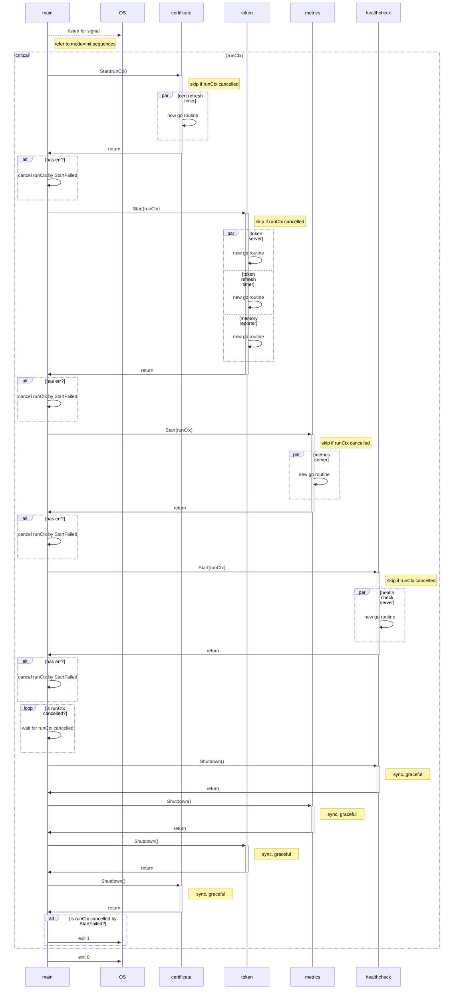

# MODE=refresh Specification

- [Sequence Diagram](#sequence-diagram)

## Sequence Diagram



## Expectation

- goroutine should ONLY be created in `Start()`
  - `Shutdown()` should notify ALL the goroutines to stop, and wait until ALL goroutines stopped gracefully using WaitGroup

- to confirm server is ready, so that the server can be shutdown gracefully. `WaitForServerReady()` should ONLY be *success* OR *retry until error* instead of allowing cancellation 
- for system integration, should finish the whole code block instead of stopping immediately on error or signal
- 

| case ID | event                | trigger time                                         | certificate | token     | metrics   | healthcheck | ALL `Shutdown()` | exit code |
| ------- | -------------------- | ---------------------------------------------------- | ----------- | --------- | --------- | ----------- | ---------------- | --------- |
| 000     | SIGINT (normal case) | before `is runCtxcancelled?`                         | ✅ success   | ✅ success | ✅ success | ✅ success   | ✅ success        | 0         |
| 001     | SIGINT               | before `certificate Start(runCtx)`                   |             |           |           |             |                  |           |
| 002     | SIGINT               | before `token Start(runCtx)`                         |             |           |           |             |                  |           |
| 003     | SIGINT               | before `metrics Start(runCtx)`                       |             |           |           |             |                  |           |
| 004     | SIGINT               | before `healthcheck Start(runCtx)`                   |             |           |           |             |                  |           |
| 005     | SIGINT               | before `cert refresh timer goroutine`                |             |           |           |             |                  |           |
| 006     | SIGINT               | before `token server goroutine`                      |             |           |           |             |                  |           |
| 007     | SIGINT               | before `token refresh timer goroutine`               |             |           |           |             |                  |           |
| 008     | SIGINT               | before `memory reporter goroutine`                   |             |           |           |             |                  |           |
| 009     | SIGINT               | before `metrics server goroutine`                    |             |           |           |             |                  |           |
| 010     | SIGINT               | before `healthcheck server goroutine`                |             |           |           |             |                  |           |
| 011     | error                | in `certificate Start(runCtx)`                               | ❌ error     | ⏭️ skipped | ⏭️ skipped | ⏭️ skipped   | ✅ success        | 1         |
| 012     | error                | in `token Start(runCtx)`                                     | ✅ success   | ❌ error   | ⏭️ skipped | ⏭️ skipped   | ✅ success        | 1         |
| 013     | error                | in `metrics Start(runCtx)`                                   | ✅ success   | ✅ success | ❌ error   | ⏭️ skipped   | ✅ success        | 1         |
| 014     | error                | in `healthcheck Start(runCtx)`                               | ✅ success   | ✅ success | ✅ success | ❌ error     | ✅ success        | 1         |
| 015     | error + SIGINT       | error in `metrics Start(runCtx)`, SIGINT during `Shutdown()` | ✅ success   | ✅ success | ❌ error   | ⏭️ skipped   | ✅ success        | 1         |


## Logs

<details>
<summary>Click to expand!</summary>

### 000

```text
INFO[2024-03-14T11:22:55+09:00] Starting token provider server[:8880]
INFO[2024-03-14T11:22:55+09:00] Will refresh key[./.local/private.pem], cert[./.local/cert.pem] and certificates for roles[[user.wfan.provider:role.dummy-role]] with provider[], backup[read+write] and secret[] after 24h0m0s
INFO[2024-03-14T11:22:55+09:00] Received request: method[GET], endpoint[/], remoteAddr[127.0.0.1:64953] requestID[f4ee534f-8a39-4fa5-9c12-94f1eeb6354b]
WARNING[2024-03-14T11:22:55+09:00] Client error: while handling request with: X-Athenz-Domain[] X-Athenz-Role[], error[http headers not set: X-Athenz-Domain[] X-Athenz-Role[].]
INFO[2024-03-14T11:22:55+09:00] Response sent: statusCode[400], latency[140.917µs], requestID[f4ee534f-8a39-4fa5-9c12-94f1eeb6354b]
INFO[2024-03-14T11:22:55+09:00] Starting metrics exporter server[:9999]
INFO[2024-03-14T11:22:55+09:00] Will refresh tokens after 30m0s
WARN[0000] failed to parse "./.local/ca.pem": readlink ./.local/ca.pem: no such file or directory
WARNING[2024-03-14T11:22:55+09:00] Unable to confirm the server ready: Get "http://:9999": dial tcp :9999: connect: connection refused. Retrying in 5.796699685s
INFO[0000] 3 valid certificate(s) found in ".local/cert.pem"
INFO[0000] 2 valid certificate(s) found in ".local/user.wfan.provider_dummy-role.cert.pem"
INFO[0000] parsed 5 certificates (1 read failures)
level=info ts=2024-03-14T02:22:55.144Z caller=tls_config.go:313 msg="Listening on" address=[::]:9999
level=info ts=2024-03-14T02:22:55.144Z caller=tls_config.go:316 msg="TLS is disabled." http2=false address=[::]:9999
INFO[2024-03-14T11:23:00+09:00] Starting health check server[:9998]

INFO[2024-03-14T11:23:08+09:00] Received signal: interrupt
INFO[2024-03-14T11:23:08+09:00] Initiating shutdown by caused: received signal: interrupt ...
INFO[2024-03-14T11:23:08+09:00] Initiating shutdown of health check daemon ...
INFO[2024-03-14T11:23:08+09:00] Stopped health check server
INFO[2024-03-14T11:23:08+09:00] Initiating shutdown of metrics exporter daemon ...
INFO[2024-03-14T11:23:08+09:00] Stopped metrics exporter server
INFO[2024-03-14T11:23:08+09:00] Initiating shutdown of token provider daemon ...
INFO[2024-03-14T11:23:08+09:00] Delaying token provider server shutdown for 0s to shutdown gracefully ...
INFO[2024-03-14T11:23:08+09:00] Stopped memory reporter daemon
INFO[2024-03-14T11:23:08+09:00] Stopped token provider daemon
INFO[2024-03-14T11:23:08+09:00] Stopped token provider server
INFO[2024-03-14T11:23:08+09:00] Initiating shutdown of certificate provider daemon ...
INFO[2024-03-14T11:23:08+09:00] Stopped certificate provider daemon
INFO[2024-03-14T11:23:08+09:00] Shutdown completed!
Process 5378 has exited with status 0
```


### 011

```text
ERROR[2024-03-14T12:05:56+09:00] Error starting certificate provider: test error
INFO[2024-03-14T12:05:56+09:00] Skipped token provider start
INFO[2024-03-14T12:05:56+09:00] Skipped metrics exporter start
INFO[2024-03-14T12:05:56+09:00] Skipped health check start
INFO[2024-03-14T12:05:56+09:00] Will refresh key[./.local/private.pem], cert[./.local/cert.pem] and certificates for roles[[user.wfan.provider:role.dummy-role]] with provider[], backup[read+write] and secret[] after 24h0m0s
INFO[2024-03-14T12:05:56+09:00] Initiating shutdown by caused: start failed: test error ...
INFO[2024-03-14T12:05:56+09:00] Initiating shutdown of health check daemon ...
INFO[2024-03-14T12:05:56+09:00] Initiating shutdown of metrics exporter daemon ...
INFO[2024-03-14T12:05:56+09:00] Initiating shutdown of token provider daemon ...
INFO[2024-03-14T12:05:56+09:00] Initiating shutdown of certificate provider daemon ...
INFO[2024-03-14T12:05:56+09:00] Stopped certificate provider daemon
FATAL[2024-03-14T12:05:56+09:00] Start failed by caused: start failed: test error
Process 58436 has exited with status 1
```

### 012

```text
INFO[2024-03-14T12:15:38+09:00] Starting token provider server[:8880]        
INFO[2024-03-14T12:15:38+09:00] Will refresh key[./.local/private.pem], cert[./.local/cert.pem] and certificates for roles[[user.wfan.provider:role.dummy-role]] with provider[], backup[read+write] and secret[] after 24h0m0s 
INFO[2024-03-14T12:15:38+09:00] Received request: method[GET], endpoint[/], remoteAddr[127.0.0.1:50652] requestID[7a72f472-c10b-487d-afdb-31a966d64e4a] 
WARNING[2024-03-14T12:15:38+09:00] Client error: while handling request with: X-Athenz-Domain[] X-Athenz-Role[], error[http headers not set: X-Athenz-Domain[] X-Athenz-Role[].] 
INFO[2024-03-14T12:15:38+09:00] Response sent: statusCode[400], latency[115µs], requestID[7a72f472-c10b-487d-afdb-31a966d64e4a] 
ERROR[2024-03-14T12:15:38+09:00] Error starting token provider: test error    
INFO[2024-03-14T12:15:38+09:00] Skipped metrics exporter start               
INFO[2024-03-14T12:15:38+09:00] Skipped health check start                   
INFO[2024-03-14T12:15:38+09:00] Will refresh tokens after 30m0s              
INFO[2024-03-14T12:15:38+09:00] Initiating shutdown by caused: start failed: test error ... 
INFO[2024-03-14T12:15:38+09:00] Initiating shutdown of health check daemon ... 
INFO[2024-03-14T12:15:38+09:00] Initiating shutdown of metrics exporter daemon ... 
INFO[2024-03-14T12:15:38+09:00] Initiating shutdown of token provider daemon ... 
INFO[2024-03-14T12:15:38+09:00] Delaying token provider server shutdown for 0s to shutdown gracefully ... 
INFO[2024-03-14T12:15:38+09:00] Stopped memory reporter daemon               
INFO[2024-03-14T12:15:38+09:00] Stopped token provider daemon                
INFO[2024-03-14T12:15:38+09:00] Stopped token provider server                
INFO[2024-03-14T12:15:38+09:00] Initiating shutdown of certificate provider daemon ... 
INFO[2024-03-14T12:15:38+09:00] Stopped certificate provider daemon          
FATAL[2024-03-14T12:15:38+09:00] Start failed by caused: start failed: test error 
Process 58436 has exited with status 1
```

### 013

```text
INFO[2024-03-14T12:23:53+09:00] Starting token provider server[:8880]        
INFO[2024-03-14T12:23:53+09:00] Will refresh key[./.local/private.pem], cert[./.local/cert.pem] and certificates for roles[[user.wfan.provider:role.dummy-role]] with provider[], backup[read+write] and secret[] after 24h0m0s 
INFO[2024-03-14T12:23:53+09:00] Received request: method[GET], endpoint[/], remoteAddr[127.0.0.1:50907] requestID[3db1c933-78bb-4625-992f-8dbc7486c7f4] 
WARNING[2024-03-14T12:23:53+09:00] Client error: while handling request with: X-Athenz-Domain[] X-Athenz-Role[], error[http headers not set: X-Athenz-Domain[] X-Athenz-Role[].] 
INFO[2024-03-14T12:23:53+09:00] Response sent: statusCode[400], latency[105.667µs], requestID[3db1c933-78bb-4625-992f-8dbc7486c7f4] 
INFO[2024-03-14T12:23:53+09:00] Starting metrics exporter server[:9999]      
INFO[2024-03-14T12:23:53+09:00] Will refresh tokens after 30m0s              
WARN[0000] failed to parse "./.local/ca.pem": readlink ./.local/ca.pem: no such file or directory 
WARNING[2024-03-14T12:23:53+09:00] Unable to confirm the server ready: Get "http://:9999": dial tcp :9999: connect: connection refused. Retrying in 5.81320865s 
INFO[0000] 3 valid certificate(s) found in ".local/cert.pem" 
INFO[0000] 2 valid certificate(s) found in ".local/user.wfan.provider_dummy-role.cert.pem" 
INFO[0000] parsed 5 certificates (1 read failures)      
level=info ts=2024-03-14T03:23:53.185Z caller=tls_config.go:313 msg="Listening on" address=[::]:9999
level=info ts=2024-03-14T03:23:53.185Z caller=tls_config.go:316 msg="TLS is disabled." http2=false address=[::]:9999
ERROR[2024-03-14T12:23:59+09:00] Error starting metrics exporter: test error  
INFO[2024-03-14T12:23:59+09:00] Skipped health check start                   
INFO[2024-03-14T12:23:59+09:00] Initiating shutdown by caused: start failed: test error ... 
INFO[2024-03-14T12:23:59+09:00] Initiating shutdown of health check daemon ... 
INFO[2024-03-14T12:23:59+09:00] Initiating shutdown of metrics exporter daemon ... 
INFO[2024-03-14T12:23:59+09:00] Stopped metrics exporter server              
INFO[2024-03-14T12:23:59+09:00] Initiating shutdown of token provider daemon ... 
INFO[2024-03-14T12:23:59+09:00] Delaying token provider server shutdown for 0s to shutdown gracefully ... 
INFO[2024-03-14T12:23:59+09:00] Stopped token provider server                
INFO[2024-03-14T12:23:59+09:00] Stopped token provider daemon                
INFO[2024-03-14T12:23:59+09:00] Stopped memory reporter daemon               
INFO[2024-03-14T12:23:59+09:00] Initiating shutdown of certificate provider daemon ... 
INFO[2024-03-14T12:23:59+09:00] Stopped certificate provider daemon          
FATAL[2024-03-14T12:23:59+09:00] Start failed by caused: start failed: test error 
Process 58436 has exited with status 1
```

### 014

```text
INFO[2024-03-14T12:29:21+09:00] Starting token provider server[:8880]        
INFO[2024-03-14T12:29:21+09:00] Will refresh key[./.local/private.pem], cert[./.local/cert.pem] and certificates for roles[[user.wfan.provider:role.dummy-role]] with provider[], backup[read+write] and secret[] after 24h0m0s 
INFO[2024-03-14T12:29:21+09:00] Received request: method[GET], endpoint[/], remoteAddr[127.0.0.1:51107] requestID[ee635ce5-9a31-4fa8-ab92-70d7b108cfe5] 
WARNING[2024-03-14T12:29:21+09:00] Client error: while handling request with: X-Athenz-Domain[] X-Athenz-Role[], error[http headers not set: X-Athenz-Domain[] X-Athenz-Role[].] 
INFO[2024-03-14T12:29:21+09:00] Response sent: statusCode[400], latency[70.458µs], requestID[ee635ce5-9a31-4fa8-ab92-70d7b108cfe5] 
INFO[2024-03-14T12:29:21+09:00] Starting metrics exporter server[:9999]      
INFO[2024-03-14T12:29:21+09:00] Will refresh tokens after 30m0s              
WARN[0000] failed to parse "./.local/ca.pem": readlink ./.local/ca.pem: no such file or directory 
WARNING[2024-03-14T12:29:21+09:00] Unable to confirm the server ready: Get "http://:9999": dial tcp :9999: connect: connection refused. Retrying in 7.435181037s 
INFO[0000] 3 valid certificate(s) found in ".local/cert.pem" 
INFO[0000] 2 valid certificate(s) found in ".local/user.wfan.provider_dummy-role.cert.pem" 
INFO[0000] parsed 5 certificates (1 read failures)      
level=info ts=2024-03-14T03:29:21.823Z caller=tls_config.go:313 msg="Listening on" address=[::]:9999
level=info ts=2024-03-14T03:29:21.823Z caller=tls_config.go:316 msg="TLS is disabled." http2=false address=[::]:9999
INFO[2024-03-14T12:29:29+09:00] Starting health check server[:9998]          
ERROR[2024-03-14T12:29:29+09:00] Error starting health check: test error      
INFO[2024-03-14T12:29:29+09:00] Initiating shutdown by caused: start failed: test error ... 
INFO[2024-03-14T12:29:29+09:00] Initiating shutdown of health check daemon ... 
INFO[2024-03-14T12:29:29+09:00] Stopped health check server                  
INFO[2024-03-14T12:29:29+09:00] Initiating shutdown of metrics exporter daemon ... 
INFO[2024-03-14T12:29:29+09:00] Stopped metrics exporter server              
INFO[2024-03-14T12:29:29+09:00] Initiating shutdown of token provider daemon ... 
INFO[2024-03-14T12:29:29+09:00] Delaying token provider server shutdown for 0s to shutdown gracefully ... 
INFO[2024-03-14T12:29:29+09:00] Stopped token provider daemon                
INFO[2024-03-14T12:29:29+09:00] Stopped token provider server                
INFO[2024-03-14T12:29:29+09:00] Stopped memory reporter daemon               
INFO[2024-03-14T12:29:29+09:00] Initiating shutdown of certificate provider daemon ... 
INFO[2024-03-14T12:29:29+09:00] Stopped certificate provider daemon          
FATAL[2024-03-14T12:29:29+09:00] Start failed by caused: start failed: test error
Process 58436 has exited with status 1
```

### 015

```text
INFO[2024-03-14T12:32:03+09:00] Starting token provider server[:8880]        
INFO[2024-03-14T12:32:03+09:00] Will refresh key[./.local/private.pem], cert[./.local/cert.pem] and certificates for roles[[user.wfan.provider:role.dummy-role]] with provider[], backup[read+write] and secret[] after 24h0m0s 
WARNING[2024-03-14T12:32:03+09:00] Unable to confirm the server ready: Get "http://:8880": dial tcp :8880: connect: connection refused. Retrying in 3.810165873s 
INFO[2024-03-14T12:32:07+09:00] Received request: method[GET], endpoint[/], remoteAddr[127.0.0.1:51207] requestID[d70254a7-d035-4180-9b31-9233204561ed] 
WARNING[2024-03-14T12:32:07+09:00] Client error: while handling request with: X-Athenz-Domain[] X-Athenz-Role[], error[http headers not set: X-Athenz-Domain[] X-Athenz-Role[].] 
INFO[2024-03-14T12:32:07+09:00] Response sent: statusCode[400], latency[444.167µs], requestID[d70254a7-d035-4180-9b31-9233204561ed] 
INFO[2024-03-14T12:32:07+09:00] Starting metrics exporter server[:9999]      
INFO[2024-03-14T12:32:07+09:00] Will refresh tokens after 30m0s              
WARNING[2024-03-14T12:32:07+09:00] Unable to confirm the server ready: Get "http://:9999": dial tcp :9999: connect: connection refused. Retrying in 3.652885774s 
WARN[0004] failed to parse "./.local/ca.pem": readlink ./.local/ca.pem: no such file or directory 
INFO[0004] 3 valid certificate(s) found in ".local/cert.pem" 
INFO[0004] 2 valid certificate(s) found in ".local/user.wfan.provider_dummy-role.cert.pem" 
INFO[0004] parsed 5 certificates (1 read failures)      
level=info ts=2024-03-14T03:32:07.135Z caller=tls_config.go:313 msg="Listening on" address=[::]:9999
level=info ts=2024-03-14T03:32:07.135Z caller=tls_config.go:316 msg="TLS is disabled." http2=false address=[::]:9999
ERROR[2024-03-14T12:32:10+09:00] Error starting metrics exporter: test error  
INFO[2024-03-14T12:32:10+09:00] Skipped health check start                   
INFO[2024-03-14T12:32:10+09:00] Initiating shutdown by caused: start failed: test error ... 
INFO[2024-03-14T12:32:10+09:00] Received signal: interrupt                   
INFO[2024-03-14T12:32:11+09:00] Initiating shutdown of health check daemon ... 
INFO[2024-03-14T12:32:11+09:00] Initiating shutdown of metrics exporter daemon ... 
INFO[2024-03-14T12:32:11+09:00] Stopped metrics exporter server              
INFO[2024-03-14T12:32:11+09:00] Initiating shutdown of token provider daemon ... 
INFO[2024-03-14T12:32:11+09:00] Delaying token provider server shutdown for 0s to shutdown gracefully ... 
INFO[2024-03-14T12:32:11+09:00] Stopped token provider daemon                
INFO[2024-03-14T12:32:11+09:00] Stopped memory reporter daemon               
INFO[2024-03-14T12:32:11+09:00] Stopped token provider server                
INFO[2024-03-14T12:32:11+09:00] Initiating shutdown of certificate provider daemon ... 
INFO[2024-03-14T12:32:11+09:00] Stopped certificate provider daemon          
FATAL[2024-03-14T12:32:11+09:00] Start failed by caused: start failed: test error 
```

</details>
