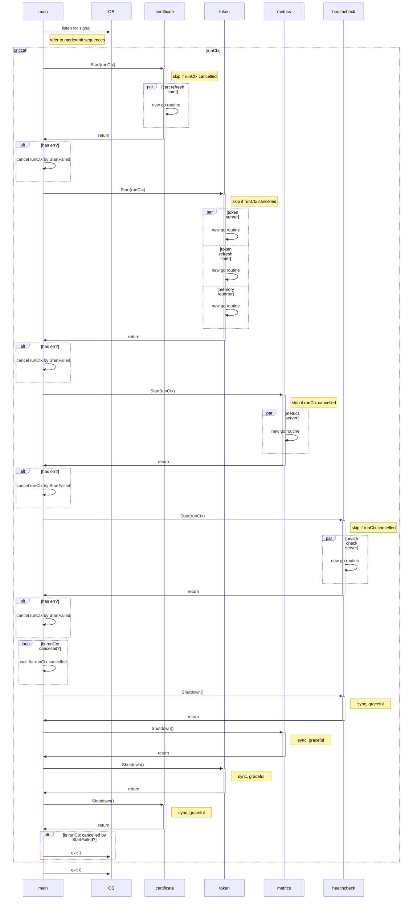

# MODE=refresh Specification

- [Sequence Diagram](#sequence-diagram)

## Sequence Diagram

```mermaid
sequenceDiagram
    main-->>+OS: listen for signal
    Note right of main: refer to mode=init sequences

    critical runCtx
    main->>+certificate: Start(runCtx)
    Note right of certificate: skip if runCtx cancelled
    par cert refresh timer
        certificate->>certificate: new go routine
    end
    certificate->>-main: return
    alt has err?
        main->>main: cancel runCtx by StartFailed
    end
    main->>+token: Start(runCtx)
    Note right of token: skip if runCtx cancelled
    par token server
        token->>token: new go routine
    and token refresh timer
        token->>token: new go routine
    and memory reporter
        token->>token: new go routine
    end
    token->>-main: return
    alt has err?
        main->>main: cancel runCtx by StartFailed
    end
    main->>+metrics: Start(runCtx)
    Note right of metrics: skip if runCtx cancelled
    par metrics server
        metrics->>metrics: new go routine
    end
    metrics->>-main: return
    alt has err?
        main->>main: cancel runCtx by StartFailed
    end
    main->>+healthcheck: Start(runCtx)
    Note right of healthcheck: skip if runCtx cancelled
    par health check server
        healthcheck->>healthcheck: new go routine
    end
    healthcheck->>-main: return
    alt has err?
        main->>main: cancel runCtx by StartFailed
    end

    loop is runCtx cancelled?
        main->>main: wait for runCtx cancelled
    end

    main->>+healthcheck: Shutdown()
    Note right of healthcheck: sync, graceful
    healthcheck->>-main: return
    main->>+metrics: Shutdown()
    Note right of metrics: sync, graceful
    metrics->>-main: return
    main->>+token: Shutdown()
    Note right of token: sync, graceful
    token->>-main: return
    main->>+certificate: Shutdown()
    Note right of certificate: sync, graceful
    certificate->>-main: return

    alt is runCtx cancelled by StartFailed?
        main->>OS: exit 1
    end
    end
    main->>OS: exit 0
```
