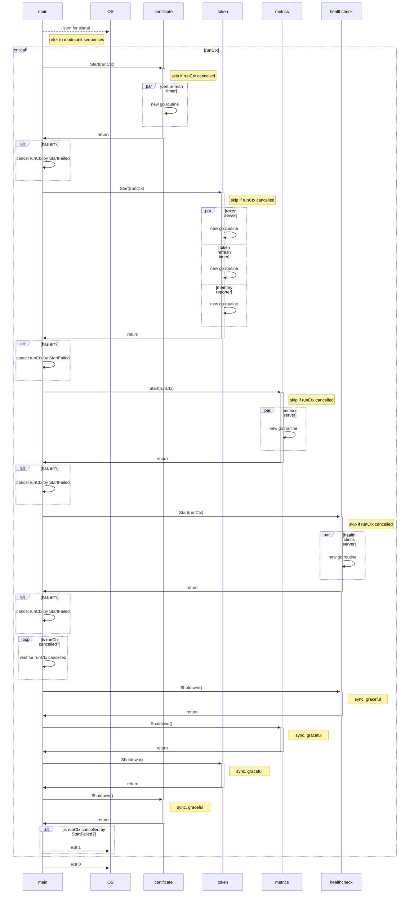

# MODE=refresh Specification

- [Sequence Diagram](#sequence-diagram)

## Sequence Diagram



## Expectation

- goroutine should ONLY be created in `Start()`
  - `Shutdown()` should notify ALL the goroutines to stop, and wait until ALL goroutines stopped gracefully using WaitGroup

- to confirm server is ready, so that the server can be shutdown gracefully. `WaitForServerReady()` should ONLY be *success* OR *retry until error* instead of allowing cancellation 
- for system integration, should finish the whole code block instead of stopping immediately on error or signal
- 

| case ID | event                | trigger time                                         | certificate | token     | metrics   | healthcheck | ALL `Shutdown()` | exit code |
| ------- | -------------------- | ---------------------------------------------------- | ----------- | --------- | --------- | ----------- | ---------------- | --------- |
| 000     | SIGINT (normal case) | before `is runCtxcancelled?`                         | ✅ success   | ✅ success | ✅ success | ✅ success   | ✅ success        | 0         |
| 001     | SIGINT               | before `certificate Start(runCtx)`                   |             |           |           |             |                  |           |
| 002     | SIGINT               | before `token Start(runCtx)`                         |             |           |           |             |                  |           |
| 003     | SIGINT               | before `metrics Start(runCtx)`                       |             |           |           |             |                  |           |
| 004     | SIGINT               | before `healthcheck Start(runCtx)`                   |             |           |           |             |                  |           |
| 005     | SIGINT               | before `cert refresh timer goroutine`                |             |           |           |             |                  |           |
| 006     | SIGINT               | before `token server goroutine`                      |             |           |           |             |                  |           |
| 007     | SIGINT               | before `token refresh timer goroutine`               |             |           |           |             |                  |           |
| 008     | SIGINT               | before `memory reporter goroutine`                   |             |           |           |             |                  |           |
| 009     | SIGINT               | before `metrics server goroutine`                    |             |           |           |             |                  |           |
| 010     | SIGINT               | before `healthcheck server goroutine`                |             |           |           |             |                  |           |
| 011     | error                | in `certificate Start(runCtx)`                       |             |           |           |             |                  |           |
| 012     | error                | in `token Start(runCtx)`                             |             |           |           |             |                  |           |
| 013     | error                | in `metrics Start(runCtx)`                           |             |           |           |             |                  |           |
| 014     | error                | in `healthcheck Start(runCtx)`                       |             |           |           |             |                  |           |
| 015     | error + SIGINT       | error in `Start(runCtx)`, SIGINT during `Shutdown()` |             |           |           |             |                  |           |


## Logs

<details>
<summary>Click to expand!</summary>

### 000

```text
INFO[2024-03-14T11:22:55+09:00] Starting token provider server[:8880]
INFO[2024-03-14T11:22:55+09:00] Will refresh key[./.local/private.pem], cert[./.local/cert.pem] and certificates for roles[[user.wfan.provider:role.dummy-role]] with provider[], backup[read+write] and secret[] after 24h0m0s
INFO[2024-03-14T11:22:55+09:00] Received request: method[GET], endpoint[/], remoteAddr[127.0.0.1:64953] requestID[f4ee534f-8a39-4fa5-9c12-94f1eeb6354b]
WARNING[2024-03-14T11:22:55+09:00] Client error: while handling request with: X-Athenz-Domain[] X-Athenz-Role[], error[http headers not set: X-Athenz-Domain[] X-Athenz-Role[].]
INFO[2024-03-14T11:22:55+09:00] Response sent: statusCode[400], latency[140.917µs], requestID[f4ee534f-8a39-4fa5-9c12-94f1eeb6354b]
INFO[2024-03-14T11:22:55+09:00] Starting metrics exporter server[:9999]
INFO[2024-03-14T11:22:55+09:00] Will refresh tokens after 30m0s
WARN[0000] failed to parse "./.local/ca.pem": readlink ./.local/ca.pem: no such file or directory
WARNING[2024-03-14T11:22:55+09:00] Unable to confirm the server ready: Get "http://:9999": dial tcp :9999: connect: connection refused. Retrying in 5.796699685s
INFO[0000] 3 valid certificate(s) found in ".local/cert.pem"
INFO[0000] 2 valid certificate(s) found in ".local/user.wfan.provider_dummy-role.cert.pem"
INFO[0000] parsed 5 certificates (1 read failures)
level=info ts=2024-03-14T02:22:55.144Z caller=tls_config.go:313 msg="Listening on" address=[::]:9999
level=info ts=2024-03-14T02:22:55.144Z caller=tls_config.go:316 msg="TLS is disabled." http2=false address=[::]:9999
INFO[2024-03-14T11:23:00+09:00] Starting health check server[:9998]

INFO[2024-03-14T11:23:08+09:00] Received signal: interrupt
INFO[2024-03-14T11:23:08+09:00] Initiating shutdown by caused: received signal: interrupt ...
INFO[2024-03-14T11:23:08+09:00] Initiating shutdown of health check daemon ...
INFO[2024-03-14T11:23:08+09:00] Stopped health check server
INFO[2024-03-14T11:23:08+09:00] Initiating shutdown of metrics exporter daemon ...
INFO[2024-03-14T11:23:08+09:00] Stopped metrics exporter server
INFO[2024-03-14T11:23:08+09:00] Initiating shutdown of token provider daemon ...
INFO[2024-03-14T11:23:08+09:00] Delaying token provider server shutdown for 0s to shutdown gracefully ...
INFO[2024-03-14T11:23:08+09:00] Stopped memory reporter daemon
INFO[2024-03-14T11:23:08+09:00] Stopped token provider daemon
INFO[2024-03-14T11:23:08+09:00] Stopped token provider server
INFO[2024-03-14T11:23:08+09:00] Initiating shutdown of certificate provider daemon ...
INFO[2024-03-14T11:23:08+09:00] Stopped certificate provider daemon
INFO[2024-03-14T11:23:08+09:00] Shutdown completed!
Process 5378 has exited with status 0
```


### 002
```text
Type 'dlv help' for list of commands.
WARNING[2024-03-14T12:26:01+09:00] Rotating KEY_FILE[./.local/private.key] may cause key mismatch with issued role certificate due to different rotation cycle. Please manually restart SIA when you rotate the key file. 
INFO[2024-03-14T12:26:01+09:00] Starting [__debug_bin3930365166] with version [], built on [] 
INFO[2024-03-14T12:26:01+09:00] Booting up with args: [/Users/mlajkim/oss_workspace/oss_2_k8s_athenz_sia/cmd/athenz-sia/__debug_bin3930365166], config: &{Init:false Endpoint:https://apj.zts.athenz.yahoo.co.jp:4443/zts/v1 ProviderService: DNSSuffix:athenz.yahoo.co.jp Refresh:24h0m0s DelayJitterSeconds:0 KeyFile:./.local/private.key CertFile:./.local/user-mlajkim-test-service.crt CaCertFile:./.local/ca.crt IntermediateCertBundle: Backup:read+write CertSecret: Namespace: AthenzDomain: AthenzPrefix: AthenzSuffix: ServiceAccount: SaTokenFile: PodIP:127.0.0.1 PodUID: Reloader:0x140000c4d20 ServerCACert: TargetDomainRoles:[user.wfan.provider:role.dummy-role] RoleCertDir:./.local/ RoleCertFilenameDelimiter:_ RoleCertKeyFileOutput:false RoleAuthHeader:Athenz-Role-Auth TokenType:roletoken+accesstoken TokenRefresh:30m0s TokenExpiry:0s TokenServerAddr::8880 TokenServerRESTAPI:true TokenServerTimeout:10s TokenServerTLSCAPath: TokenServerTLSCertPath: TokenServerTLSKeyPath: TokenDir:./.local/ MetricsServerAddr::9999 HealthCheckAddr::9998 HealthCheckEndpoint:/healthz DeleteInstanceID:false UseTokenServer:true ShutdownTimeout:1m0s ShutdownDelay:0s LogDir: LogLevel:INFO rawMode:refresh rawPodIP:127.0.0.1 rawTargetDomainRoles:user.wfan.provider:role.dummy-role rawRefresh:24h rawDelayJitterSeconds:0 rawRoleCertKeyFileOutput:false rawTokenRefresh:30m0s rawTokenExpiry:0s rawTokenServerRESTAPI:true rawTokenServerTimeout:10s rawDeleteInstanceID:false rawUseTokenServer:true rawShutdownTimeout:60s rawShutdownDelay:0s} 
INFO[2024-03-14T12:26:01+09:00] Certificate provisioning is disabled with empty options: provider service[] 
INFO[2024-03-14T12:26:01+09:00] Attempting to get x509 role certs from identity provider: targets[[user.wfan.provider:role.dummy-role]]... 
INFO[2024-03-14T12:26:02+09:00] Successfully received x509 role certs from identity provider 
INFO[2024-03-14T12:26:02+09:00] [New Role Certificate] Subject: CN=user.wfan.provider:role.dummy-role,OU=Athenz,O=,ST=,C=US, Issuer: CN=YPKI Signed Athenz CA,OU=Athenz,O=Athenz,ST=Tokyo,C=JP, NotBefore: 2024-03-14 03:26:02 +0000 UTC, NotAfter: 2054-03-07 03:12:02 +0000 UTC, SerialNumber: 1710386762133, DNSNames: [test.user-mlajkim.athenz.yahoo.co.jp] 
INFO[2024-03-14T12:26:02+09:00] Create ZTS client to fetch tokens: https://apj.zts.athenz.yahoo.co.jp:4443/zts/v1, &{idleMu:{state:0 sema:0} closeIdle:false idleConn:map[] idleConnWait:map[] idleLRU:{ll:<nil> m:map[]} reqMu:{state:0 sema:0} reqCanceler:map[] altMu:{state:0 sema:0} altProto:{v:<nil>} connsPerHostMu:{state:0 sema:0} connsPerHost:map[] connsPerHostWait:map[] Proxy:0x10508a290 OnProxyConnectResponse:<nil> DialContext:0x1050adb70 Dial:<nil> DialTLSContext:<nil> DialTLS:<nil> TLSClientConfig:0x14000583040 TLSHandshakeTimeout:10s DisableKeepAlives:false DisableCompression:false MaxIdleConns:100 MaxIdleConnsPerHost:0 MaxConnsPerHost:0 IdleConnTimeout:1m30s ResponseHeaderTimeout:0s ExpectContinueTimeout:1s TLSNextProto:map[] ProxyConnectHeader:map[] GetProxyConnectHeader:<nil> MaxResponseHeaderBytes:0 WriteBufferSize:0 ReadBufferSize:0 nextProtoOnce:{done:0 m:{state:0 sema:0}} h2transport:<nil> tlsNextProtoWasNil:false ForceAttemptHTTP2:true} 
INFO[2024-03-14T12:26:02+09:00] Attempting to fetch tokens from Athenz ZTS server: access token targets[[{user.wfan.provider:role.dummy-role,,0,0}]], role token targets[[{user.wfan.provider:role.dummy-role,,0,0}]]... 
INFO[2024-03-14T12:26:02+09:00] Successfully updated role token cache: target[{user.wfan.provider:role.dummy-role,,0,0}], requestID[daemon_role_token_update] 
INFO[2024-03-14T12:26:02+09:00] Successfully updated access token cache: target[{user.wfan.provider:role.dummy-role,,0,0}], requestID[daemon_access_token_update] 
INFO[2024-03-14T12:26:02+09:00] Token cache updated. accesstoken:success[1],error[0]; roletoken:success[1],error[0] 
INFO[2024-03-14T12:26:02+09:00] [New Access Token] Domain: user.wfan.provider, Role: dummy-role 
INFO[2024-03-14T12:26:02+09:00] [New Role Token] Domain: user.wfan.provider, Role: dummy-role 
INFO[2024-03-14T12:26:02+09:00] Received signal: interrupt                   
INFO[2024-03-14T12:26:03+09:00] Skipped certificate provider start           
INFO[2024-03-14T12:26:03+09:00] Skipped token provider start                 
INFO[2024-03-14T12:26:03+09:00] Skipped metrics exporter start               
INFO[2024-03-14T12:26:03+09:00] Skipped health check start                   
INFO[2024-03-14T12:26:03+09:00] Initiating shutdown by caused: received signal: interrupt ... 
INFO[2024-03-14T12:26:03+09:00] Initiating shutdown of health check daemon ... 
INFO[2024-03-14T12:26:03+09:00] Initiating shutdown of metrics exporter daemon ... 
INFO[2024-03-14T12:26:03+09:00] Initiating shutdown of token provider daemon ... 
INFO[2024-03-14T12:26:03+09:00] Initiating shutdown of certificate provider daemon ... 
INFO[2024-03-14T12:26:03+09:00] Shutdown completed!                          
Process 85518 has exited with status 0
Detaching
```


</details>
