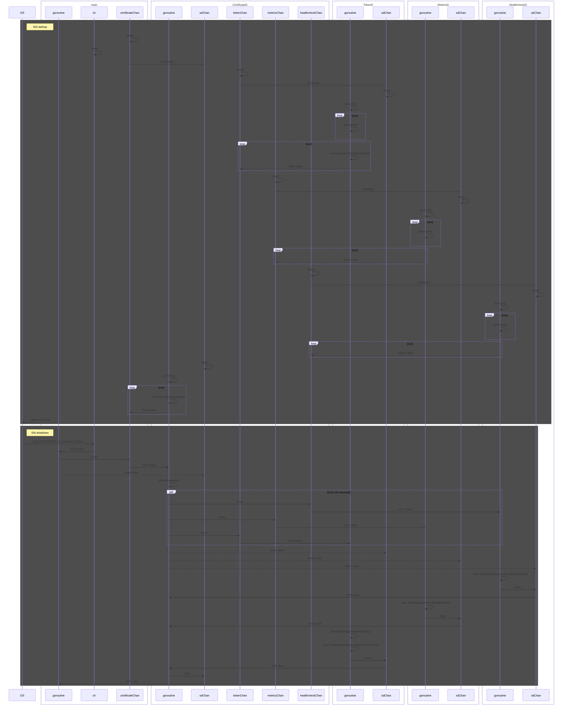

# SIA goroutine and channel

```mermaid
sequenceDiagram
    participant OS as OS
    box main
    participant mgo as goroutine
    participant mc1 as ch
    participant mc2 as certificateChan
    end
    box CertificateD
    participant cdgo as goroutine
    participant cdc1 as sdChan
    participant cdc2 as tokenChan
    participant cdc3 as metricsChan
    participant cdc4 as healthcheckChan
    end
    box TokenD
    participant tdgo as goroutine
    participant tdc1 as sdChan
    end
    box MetricsD
    participant mdgo as goroutine
    participant mdc1 as sdChan
    end
    box HealthcheckD
    participant hdgo as goroutine
    participant hdc1 as sdChan
    end
    
    rect rgb(77, 77, 77)
    note right of OS: SIA startup
    
    mc2->>mc2: make
    mc1->>mc1: make
    mc2->cdc1: exchange

    cdc2->>cdc2: make
    cdc2->tdc1: exchange
    tdc1->>tdc1: make
    tdgo->>tdgo: go func()
    loop run
        tdgo->>tdgo: start server
    end
    loop run
        tdgo->>tdgo: on every idConfig.tokenRefresh
        tdgo-->>cdc2: listen close
    end

    cdc3->>cdc3: make
    cdc3->mdc1: exchange
    mdc1->>mdc1: make
    mdgo->>mdgo: go func()
    loop run
        mdgo->>mdgo: start server
    end
    loop run
        mdgo-->>cdc3: listen close
    end

    cdc4->>cdc4: make
    cdc4->hdc1: exchange
    hdc1->>hdc1: make
    hdgo->>hdgo: go func()
    loop run
        hdgo->>hdgo: start server
    end
    loop run
        hdgo-->>cdc4: listen close
    end

    cdc1->>cdc1: make
    cdgo->>cdgo: go func()
    loop run
        cdgo->>cdgo: on every idConfig.Refresh
        cdgo-->>mc2: listen close
    end


    mgo-->>OS: listen os.Signal
    end

    rect rgb(77, 77, 77)
    note right of OS: SIA shutdown
    OS->>mc1: syscall.SIGTERM, os.Interruptos.Signal
    mc1->>mgo: ACK close
    mgo->>mc2: close
    mc2->>cdgo: ACK close
    mgo-->>cdc1: listen close

    cdgo->>cdgo: deleteRequest()
    par ACK all channels
    cdgo->>cdc4: close
    cdc4->>hdgo: ACK close
    cdgo->>cdc3: close
    cdc3->>mdgo: ACK close
    cdgo->>cdc2: close
    cdc2->>tdgo: ACK close
    end
    cdgo-->>tdc1: listen close
    cdgo-->>mdc1: listen close
    cdgo-->>hdc1: listen close
    hdgo->>hdgo: sync Shutdown(timeout=ShutdownTimeout)
    hdgo->>hdc1: close
    hdc1->>cdgo: ACK close
    mdgo->>mdgo: sync Shutdown(context.Background())
    mdgo->>mdc1: close
    mdc1->>cdgo: ACK close
    tdgo->>tdgo: Sleep(idConfig.ShutdownDelay)
    tdgo->>tdgo: sync Shutdown(timeout=ShutdownTimeout)
    tdgo->>tdc1: close
    tdc1->>cdgo: ACK close
    cdgo->>cdc1: close
    cdc1->>mgo: ACK close
    end
```
